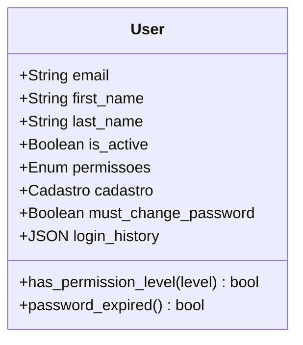
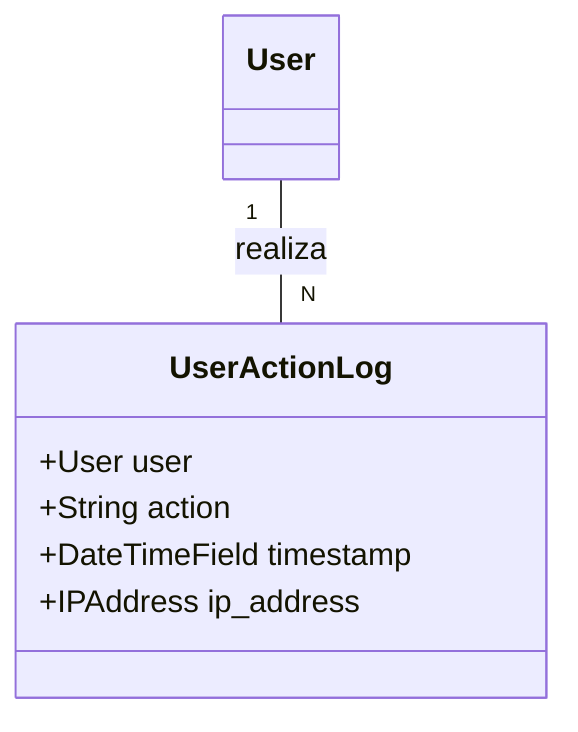
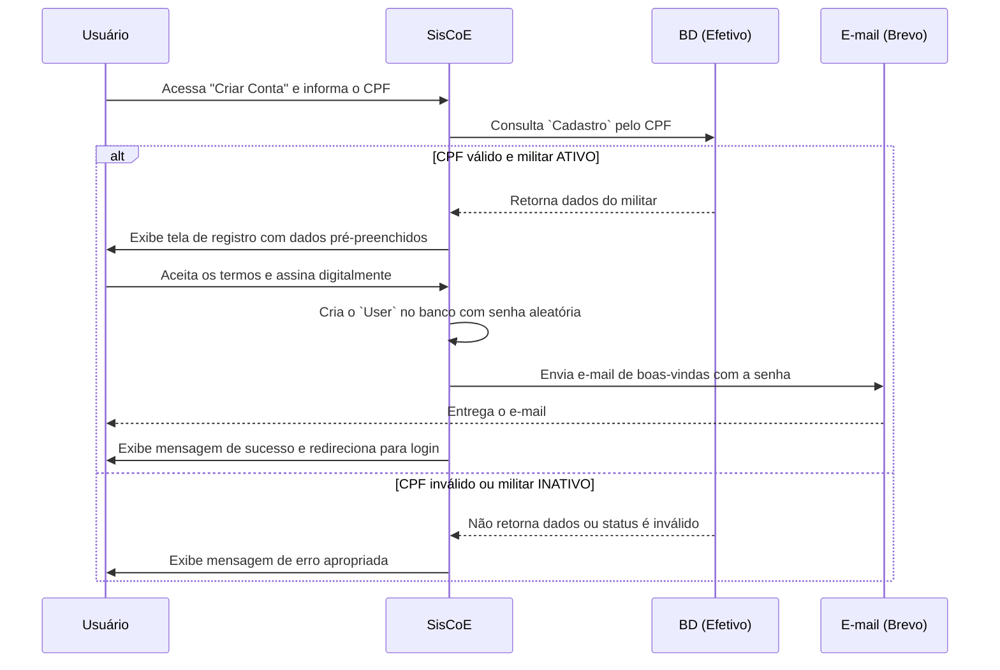

# 🧾 App: Accounts (Gestão de Usuários e Acesso)

O app `accounts` é o módulo central do SisCoE para segurança, identidade e controle de acesso. Ele gerencia todo o ciclo de vida do usuário, desde um registro seguro e verificado até a autenticação, gestão de permissões e auditoria detalhada de suas ações.

---

## 📋 Visão Geral

O propósito do `accounts` é substituir o sistema de usuário padrão do Django por um modelo customizado, alinhado às regras de negócio da Polícia Militar, garantindo que apenas militares com status válido possam acessar o sistema.

- 🎯 **Identidade Única**: Vincula cada conta de usuário a um registro único no app `efetivo`.
- 🔐 **Segurança em Camadas**: Implementa um fluxo de cadastro seguro, recuperação de senha via e-mail e troca de senha forçada no primeiro login.
- ιε **Controle de Permissões**: Utiliza um sistema hierárquico de permissões para controlar o acesso a diferentes partes do sistema.
- 🔄 **Integração com E-mail**: Delega o envio de e-mails transacionais (boas-vindas, recuperação de senha) ao serviço externo Brevo para maior confiabilidade.
- 📈 **Auditoria Completa**: Registra o histórico de logins e ações de cada usuário para fins de rastreabilidade.

---

## 🗂️ Modelos de Dados

A arquitetura é focada no modelo `User` customizado e em modelos de suporte para logs.

### User
O modelo `User` herda de `AbstractBaseUser` e `PermissionsMixin` e é o coração do sistema de autenticação.

```python
class User(AbstractBaseUser, PermissionsMixin):
    email = models.EmailField(_('email address'), unique=True)
    first_name = models.CharField(_('first name'), max_length=150)
    last_name = models.CharField(_('last name'), max_length=150)
    is_active = models.BooleanField(_('active'), default=True)
    
    # Campos customizados
    permissoes = models.CharField(max_length=20, choices=PERMISSOES_CHOICES, default="basico")
    cadastro = models.OneToOneField('efetivo.Cadastro', on_delete=models.SET_NULL, null=True)
    must_change_password = models.BooleanField(default=False)
    login_history = models.JSONField(default=list, null=True)
    
    USERNAME_FIELD = 'email'
    REQUIRED_FIELDS = ['first_name', 'last_name']
```



### UserActionLog
Registra ações importantes realizadas por um usuário.

```python
class UserActionLog(models.Model):
    user = models.ForeignKey(User, on_delete=models.CASCADE)
    action = models.CharField(max_length=255)
    timestamp = models.DateTimeField(auto_now_add=True)
    ip_address = models.GenericIPAddressField(null=True)
```



### TermosAceite
Armazena a prova de que um usuário aceitou os Termos e Condições durante o registro.

---

## 🔄 Fluxo de Trabalho

O fluxo mais crítico é o de **criação de conta**, que garante a identidade do militar.



---

## 🎯 Funcionalidades Principais

- **Criação de Conta Verificada**: Apenas militares com CPF cadastrado no app `efetivo` e com status "Efetivo" e "ATIVO" podem se registrar.
- **Autenticação Segura**: A view de login valida não apenas a senha, mas também o status do militar em tempo real, desativando o acesso se o status mudar.
- **Recuperação de Senha**: Fluxo completo de "esqueci minha senha" que envia e-mails através do Brevo.
- **Troca de Senha Forçada**: Usuários recém-criados são obrigados a definir uma nova senha no primeiro acesso.
- **Gestão de Permissões**: Interface para administradores alterarem o nível de acesso de outros usuários.

---

## 🔗 Relacionamentos

- **`efetivo` (Essencial)**: O app `accounts` possui uma forte dependência do `efetivo.Cadastro`. O `OneToOneField` no modelo `User` garante que cada conta do sistema corresponda a um e apenas um militar.
  ```python
  # No modelo User
  cadastro = models.OneToOneField(
      'efetivo.Cadastro',
      on_delete=models.SET_NULL, # Se o cadastro for excluído, o usuário não é, mas perde o vínculo
      null=True,
      related_name='user_account'
  )
  ```

---

## 🛡️ Controles de Acesso e Validações

| View | Permissão Requerida | Acesso |
| :--- | :--- | :--- |
| `user_list` | `gestor` ou superior | Gestores e Admin |
| `user_detail` | Autenticação | O próprio usuário ou Admin |
| `user_permission_update` | `admin` | Apenas Admins |
| `global_access_history` | `gestor` ou superior | Gestores e Admin |

- **✅ Validação de CPF**: A primeira etapa do registro é a validação do CPF contra a base de dados do `efetivo`.
- **✅ Validação de Status**: No login, o status do militar é verificado em tempo real. Se inativo, o acesso é bloqueado.
- **✅ Hierarquia de Permissões**: Um usuário não pode alterar as permissões de outro usuário de nível igual ou superior.

---

## 📈 Métricas e Estatísticas

- **`User.password_expired`**: `@property` que verifica se a senha do usuário expirou (a cada 180 dias).
- **`User.login_history`**: Campo JSON que permite análises sobre frequência de acesso, IPs mais utilizados e duração das sessões.
- **`UserActionLog`**: Permite criar relatórios sobre as ações mais comuns, usuários mais ativos, etc.

---

## 🎨 Interface do Usuário

- **`registration/verificacao_cpf.html`**: Primeiro passo do cadastro, onde o usuário informa o CPF.
- **`registration/registration_form.html`**: Formulário de finalização do cadastro, com os dados do militar pré-preenchidos e o campo para aceite dos termos e assinatura.
- **`accounts/user_detail.html`**: Perfil do usuário, exibindo seus dados, informações do último login e um histórico recente de acessos.
- **`accounts/user_list.html`**: Tabela de gerenciamento de usuários para administradores.

---

## 🔧 Configuração Técnica

**URLs Principais**
```python
app_name = 'accounts'

urlpatterns = [
    path('login/', v.login_view, name='login'),
    path('logout/', v.my_logout, name='logout'),
    path('register/', v.signup, name='signup'),
    path('verificar-cpf/', v.verificar_cpf, name='verificar_cpf'),
    path('password_reset/', v.MyPasswordResetView.as_view(), name='password_reset'),
    path('users/', include(user_management_patterns)),
]
```

**Dependências**
- **Brevo (via API)**: Utilizado para o envio de todos os e-mails transacionais, configurado em `brevo_service.py`.

---

## 💡 Casos de Uso

**Cenário Típico**: Um militar ativo que nunca acessou o sistema entra na página inicial e clica em "Criar Conta". Ele digita seu CPF. O sistema valida o CPF no `efetivo`, confirma que ele está ativo e o redireciona para a tela de cadastro. Seus dados (nome, RE, etc.) já aparecem na tela. Ele lê os termos, assina digitalmente e finaliza. Em instantes, recebe um e-mail com uma senha temporária. Ele faz o primeiro login e o sistema o força a criar uma nova senha pessoal antes de poder navegar.

**Benefícios**:
- **🎯 Segurança**: Garante que apenas pessoas autorizadas e com status válido tenham acesso ao sistema.
- **⚙️ Automação**: O fluxo de cadastro e envio de senha é 100% automatizado, reduzindo a carga sobre os administradores.
- **📊 Controle e Rastreabilidade**: Todas as ações e acessos são registrados, fornecendo uma trilha de auditoria clara.
- **📈 Experiência do Usuário**: Oferece um processo de autoatendimento para cadastro e recuperação de senha, moderno e eficiente.