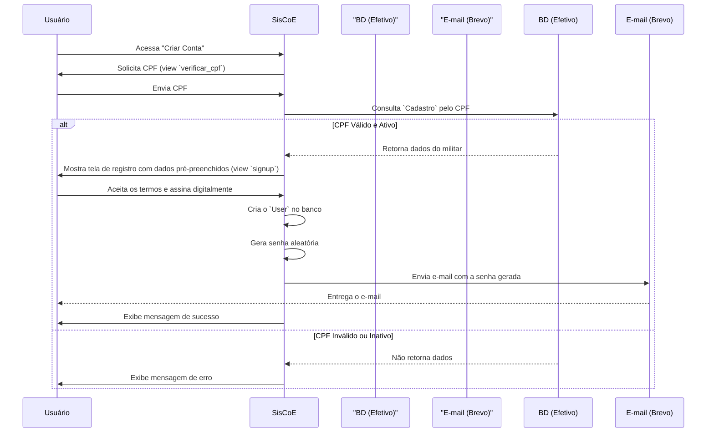

# App: Accounts

O app `accounts` é responsável por todo o ciclo de vida do usuário no SisCoE, desde o seu registro e autenticação até a gestão de permissões e auditoria de suas ações. Ele substitui o sistema de usuário padrão do Django por um modelo mais robusto e adaptado às necessidades do projeto.

---

## Modelo de Dados

O `accounts` é construído em torno de um modelo de usuário customizado e modelos de suporte para auditoria.

### O Modelo `User`

O coração do app é o modelo `User`, que herda de `AbstractBaseUser` do Django.

!!! abstract "Modelo `accounts.models.User`"
    ```python
    class User(AbstractBaseUser, PermissionsMixin):
        email = models.EmailField(unique=True)
        first_name = models.CharField(max_length=150)
        last_name = models.CharField(max_length=150)
        is_active = models.BooleanField(default=True)
        is_admin = models.BooleanField(default=False)
        
        # Campos customizados
        permissoes = models.CharField(max_length=20, choices=PERMISSOES_CHOICES, default="basico")
        cadastro = models.OneToOneField('efetivo.Cadastro', on_delete=models.SET_NULL, null=True, blank=True)
        must_change_password = models.BooleanField(default=False)
        login_history = models.JSONField(default=list, blank=True, null=True)
        
        USERNAME_FIELD = 'email'
        REQUIRED_FIELDS = ['first_name', 'last_name']
    ```

**Campos Notáveis:**
-   **`email`**: Usado como o identificador único para login, em vez de um nome de usuário.
-   **`permissoes`**: Um campo `CharField` que define o nível de acesso do usuário no sistema (ex: `basico`, `sgb`, `gestor`, `admin`). Este campo é a base para o controle de permissões hierárquico.
-   **`cadastro`**: Uma chave estrangeira `OneToOne` para o modelo `Cadastro` do app `efetivo`. Este vínculo é crucial, pois conecta a identidade do usuário no sistema à sua ficha militar.
-   **`must_change_password`**: Um booleano que, se `True`, força o usuário a trocar sua senha no primeiro login.
-   **`login_history`**: Um campo `JSONField` que armazena um log detalhado de cada sessão de login do usuário, incluindo IP, nome do computador e horários de login/logout.

### Modelos de Auditoria

-   **`UserActionLog`**: Registra ações importantes realizadas por um usuário, como "Fez login" ou "Alterou senha".
-   **`TermosAceite`**: Armazena a prova de que um usuário aceitou os termos e condições durante o registro, incluindo a data, IP e uma cópia da assinatura digital.

---

## Fluxo de Criação de Conta

O processo de criação de conta é projetado para garantir que apenas militares ativos e válidos possam se registrar.



---

## Autenticação e Segurança

### Login
A view de login (`login_view`) não apenas valida as credenciais do usuário, mas também executa uma verificação crítica em tempo real:
1.  Autentica o usuário com e-mail e senha.
2.  Verifica o `cadastro` associado no app `efetivo`.
3.  Confere se a situação do militar é "Efetivo" e "ATIVO".
4.  Se a verificação falhar, o login é impedido e o usuário é desativado (`is_active = False`) como medida de segurança.

### Recuperação de Senha
O fluxo de "Esqueci Minha Senha" utiliza as views padrão do Django, mas as sobrescreve (`MyPasswordResetView`, etc.) para delegar o envio de e-mails ao serviço **Brevo**, garantindo alta taxa de entrega e desacoplamento.

### Troca de Senha Forçada
Se o campo `must_change_password` de um usuário for `True`, ele é automaticamente redirecionado para a view `force_password_change_view` após o login, garantindo que senhas temporárias ou iniciais sejam imediatamente substituídas.

---

## Gestão e Auditoria

O app `accounts` fornece um conjunto completo de ferramentas para administradores e gestores:

-   **Lista de Usuários (`/users/`)**: Permite visualizar todos os usuários cadastrados.
-   **Detalhes do Usuário (`/users/<pk>/`)**: Exibe informações detalhadas de um usuário, incluindo seu histórico de logins recentes.
-   **Alteração de Permissões (`/users/<pk>/permission_update/`)**: Uma interface para gestores e administradores ajustarem o nível de permissão (`permissoes`), o status de ativo e outras flags de segurança de um usuário.
-   **Históricos Globais**: Views como `global_access_history` e `global_user_action_history` permitem uma auditoria completa de todos os acessos e ações no sistema.