# App: Adicional

O app `adicional` é um módulo especializado para o **Controle de Adicional por Tempo de Serviço (ATS)**, também conhecido como quinquênio, e para a gestão do benefício da **sexta-parte**.

Ele gerencia todo o ciclo de vida do ATS de um militar, desde o cálculo da data de direito, passando pelo lançamento em sistemas de pagamento, até a publicação em boletim e o encerramento do ciclo atual para dar início ao próximo.

---

## Modelo de Dados

A arquitetura de dados do app é focada em manter o estado atual do benefício e, ao mesmo tempo, uma trilha de auditoria completa de todas as alterações.

-   **`Cadastro_adicional`**: Este é o modelo principal. Cada registro representa o **bloco de tempo de serviço atual** (um quinquênio) de um militar. Ele contém as datas, o status do workflow e os dados de publicação.
-   **`HistoricoCadastro`**: Este modelo é um "espelho" do `Cadastro_adicional`. Toda vez que um registro principal é alterado, uma cópia de seu estado é salva aqui, garantindo um histórico imutável.

!!! abstract "Modelo `adicional.models.Cadastro_adicional`"
    ::: backend.adicional.models.Cadastro_adicional
        options:
          show_root_heading: false
          show_source: false

---

## Fluxo de Vida de um Adicional (Workflow)

O status de um adicional progride através de um workflow bem definido, representado pelo campo `status_adicional`.

```mermaid
stateDiagram-v2
    direction LR
    [*] --> Aguardando_Requisitos
    Aguardando_Requisitos --> Faz_Jus: Data de direito atingida
    Faz_Jus --> Lancado_em_SIPA: Gestor registra no SIPA
    Lancado_em_SIPA --> Aguardando_Publicacao: Gestor aguarda publicação
    Aguardando_Publicacao --> Publicado: Gestor registra dados do Boletim
    Publicado --> Encerrado: Gestor conclui o ciclo
    Encerrado --> [*]
```

1.  **Aguardando Requisitos**: O estado inicial. O sistema aguarda a data em que o militar terá direito ao próximo adicional.
2.  **Faz Jus**: A data de direito foi atingida. O adicional está pronto para ser processado pela administração. O `signal` `check_adicional_status` ajuda a automatizar essa transição.
3.  **Lançado em SIPA**: Um gestor confirma que o benefício foi lançado no SIPA (Sistema Integrado de Pagamentos).
4.  **Aguardando Publicação**: Aguardando a publicação da concessão em Boletim Geral (BOL G PM).
5.  **Publicado**: O gestor insere os dados da publicação (número do boletim e data).
6.  **Encerrado**: O ciclo do adicional atual é finalizado, e o sistema está pronto para que o próximo bloco de 5 anos seja cadastrado.

---

## Endpoints (URLs) Principais

| URL | View | Nome da URL | Descrição |
| --- | --- | --- | --- |
| `/cadastrar/` | `cadastrar_adicional` | `cadastrar_adicional` | Inicia o cadastro de um adicional para um militar. |
| `/listar/` | `listar_adicional` | `listar_adicional` | Lista todos os adicionais em andamento, com seus status. |
| `/ver-adicional/<int:id>/` | `ver_adicional` | `ver_adicional` | Exibe a página de detalhes completa de um ciclo de adicional. |
| `/historico-adicional/<int:id>/` | `historico_adicional` | `historico_adicional` | Mostra o histórico de todas as alterações de um adicional. |
| `/concluir-adicional/<int:id>/` | `concluir_adicional` | `concluir_adicional` | Executa a ação de concluir (encerrar) o ciclo de um adicional. |
| `/editar-concessao/<int:pk>/` | `editar_concessao` | `editar_concessao` | Permite ao gestor inserir os dados de publicação do boletim. |
| `/confirmar-sipa/<int:pk>/` | `confirmar_sipa` | `confirmar_sipa` | Confirma que o adicional foi lançado no sistema de pagamento. |

---

## Sinais e Automações (`signals.py`)

-   **`check_adicional_status(sender, instance, ...)`**:
    -   **Gatilho**: `post_save` no modelo `Cadastro_adicional`.
    -   **Ação**: Após salvar uma alteração, este sinal verifica se a data do `proximo_adicional` já foi atingida. Se sim, e se o status ainda for `Aguardando Requisitos`, ele o atualiza automaticamente para `Faz Jus`, sinalizando para a administração que uma ação é necessária.