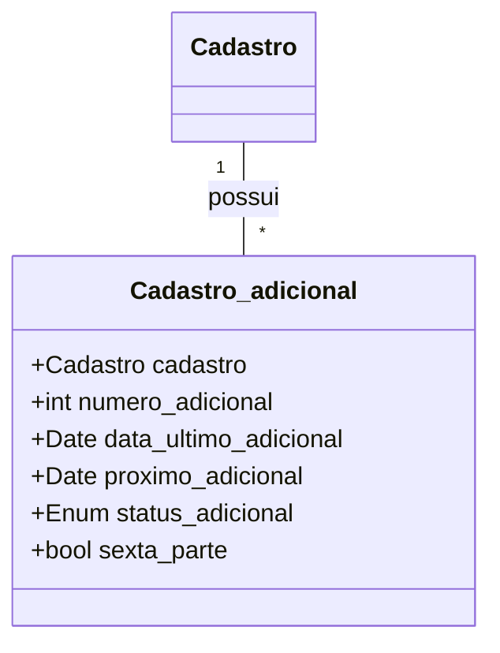
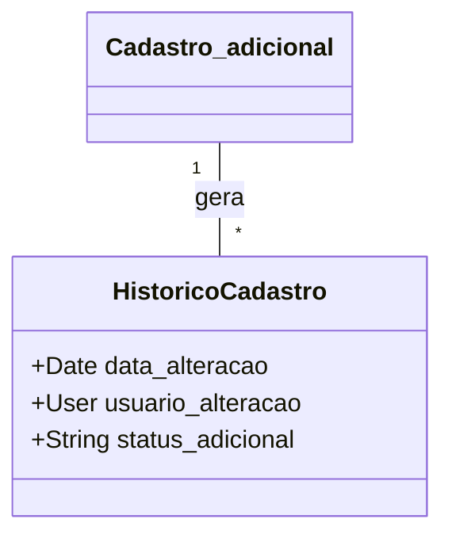
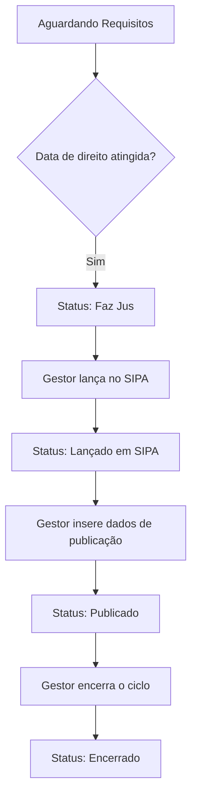

# 🧾 App: Adicional (Gestão de Adicional por Tempo de Serviço)

O app `adicional` é o módulo do SisCoE para o controle do Adicional por Tempo de Serviço (ATS), também conhecido como quinquênio, e para a gestão do benefício da sexta-parte. Ele gerencia todo o ciclo de vida do ATS de um militar, desde o cálculo da data de direito até a publicação em boletim.

---

## 📋 Visão Geral

O propósito do app é automatizar e criar uma trilha de auditoria confiável para a concessão do ATS, um benefício de carreira que se repete a cada 5 anos. Ele serve ao setor de RH (B/1) como ferramenta principal para gerenciar esse processo.

- 🎯 **Controle de Quinquênio**: Acompanha cada bloco de 5 anos de serviço do militar.
-  workflow **Workflow de Status**: Gerencia o progresso de um adicional através de um fluxo de status claro (ex: de "Aguardando" para "Faz Jus" e "Publicado").
-  sexta **Gestão da 6ª Parte**: Inclui campos específicos para controlar a concessão da sexta-parte, que ocorre após 20 anos de serviço (no 4º adicional).
- 🔄 **Histórico Imutável**: Cada alteração em um registro de adicional é salva em um modelo de histórico, garantindo total rastreabilidade.

---

## 🗂️ Modelos de Dados

A arquitetura separa o registro ativo do seu histórico, garantindo a integridade dos dados.

### Cadastro_adicional
Este é o modelo principal. Cada registro representa o bloco de tempo de serviço (quinquênio) que está sendo acompanhado para um militar.

```python
class Cadastro_adicional(models.Model):
    class StatusAdicional(models.TextChoices):
        AGUARDANDO_REQUISITOS = 'aguardando_requisitos', 'Aguardando Requisitos'
        FAZ_JUS = 'faz_jus', 'Faz Jus'
        LANCADO_SIPA = 'lancado_sipa', 'Lançado em SIPA'
        # ... outros status

    cadastro = models.ForeignKey('efetivo.Cadastro', on_delete=models.CASCADE)
    numero_adicional = models.PositiveSmallIntegerField(choices=N_CHOICES)
    data_ultimo_adicional = models.DateField()
    proximo_adicional = models.DateField(null=True, blank=True)
    status_adicional = models.CharField(max_length=30, choices=StatusAdicional.choices, default=StatusAdicional.AGUARDANDO_REQUISITOS)
    sexta_parte = models.BooleanField(default=False)
```



### HistoricoCadastro
Este modelo é um "espelho" do `Cadastro_adicional`. Uma cópia (snapshot) do registro principal é salva aqui sempre que uma alteração significativa ocorre.

```python
class HistoricoCadastro(models.Model):
    cadastro_adicional = models.ForeignKey(Cadastro_adicional, on_delete=models.CASCADE)
    usuario_alteracao = models.ForeignKey(settings.AUTH_USER_MODEL, on_delete=models.SET_NULL, null=True)
    data_alteracao = models.DateTimeField(auto_now_add=True)
    # ... (réplica de todos os campos do Cadastro_adicional)
```



---

## 🔄 Fluxo de Trabalho

O ciclo de vida de um adicional segue um fluxo de status bem definido, com ações do gestor de RH em cada etapa.



---

## 🎯 Funcionalidades Principais

- **Criação de Adicional**: Formulário para iniciar o acompanhamento de um novo quinquênio para um militar, a partir da data do último adicional concedido.
- **Listagem e Acompanhamento**: A view `listar_adicional` exibe todos os adicionais em andamento, com badges de status que indicam visualmente a situação de cada um (ex: "Aguardar", "Lançar", "Vencido").
- **Detalhes e Histórico**: A página `ver_adicional` mostra todos os detalhes do ciclo atual e uma tabela com todo o histórico de alterações daquele adicional.
- **Ações do Gestor**: A interface oferece botões para que o gestor execute ações específicas do workflow, como "Confirmar Lançamento no SIPA" e "Registrar Publicação".
- **Controle da 6ª Parte**: O sistema automaticamente identifica quando o 4º adicional está sendo processado e exibe a opção para o gestor confirmar a concessão da sexta-parte.

---

## 🔗 Relacionamentos

- **`efetivo` (Essencial)**: O app `adicional` depende diretamente do `efetivo.Cadastro`. Cada registro de `Cadastro_adicional` está ligado a um militar.
  ```python
  # No modelo Cadastro_adicional
  cadastro = models.ForeignKey('efetivo.Cadastro', on_delete=models.CASCADE)
  ```
- **`accounts`**: O sistema registra qual `User` realizou cada criação, alteração ou conclusão de um adicional, garantindo a auditoria.

---

## 🛡️ Controles de Acesso e Validações

| View | Permissão Requerida | Acesso |
| :--- | :--- | :--- |
| `listar_adicional` | Autenticação | Todos os usuários logados |
| `cadastrar_adicional` | `adicional.add_cadastro_adicional` | Gestores e Admin |
| `concluir_adicional` | `adicional.can_concluir_adicional` | Gestores e Admin |

- **✅ Validação de Conclusão**: Um adicional só pode ser marcado como "Concluído" se os campos de data de concessão e usuário da conclusão estiverem preenchidos.
- **✅ Validação de Senha**: Ações críticas como "Concluir Adicional" e "Excluir Adicional" exigem que o gestor confirme sua senha para prosseguir.
- **✅ Integridade de Dados**: O método `clean` do modelo `Cadastro_adicional` possui validações para impedir que datas futuras ou números de bloco inválidos sejam inseridos.

---

## 📈 Métricas e Estatísticas

- **`status_adicional_display`**: Uma `@property` que retorna um badge HTML colorido indicando o status do adicional (Aguardar, Lançar, Vencido), facilitando a identificação visual na listagem.
- **`tempo_ats_detalhada`**: Uma `@property` que calcula e exibe o tempo de serviço decorrido desde o último adicional em anos, meses e dias.

---

## 🎨 Interface do Usuário

- **`listar_adicional.html`**: Tabela principal que lista todos os adicionais, com filtros e os badges de status para uma rápida identificação das pendências.
- **`detalhar_adicional.html`**: Página de detalhes que funciona como um painel de controle para um adicional específico, exibindo o workflow, os dados atuais e os botões de ação para o gestor.
- **`historico_adicional.html`**: Tela que exibe a trilha de auditoria completa para um registro de adicional.

---

## 🔧 Configuração Técnica

**URLs Principais**
```python
app_name = 'adicional'

urlpatterns = [
    path('cadastrar/', views.cadastrar_adicional, name='cadastrar_adicional'),
    path('listar/', views.listar_adicional, name='listar_adicional'),
    path('ver-adicional/<int:id>/', views.ver_adicional, name='ver_adicional'),
    path('concluir-adicional/<int:id>/', views.concluir_adicional, name='concluir_adicional'),
]
```

**Dependências**: Nenhuma dependência externa crítica além do próprio Django e do app `efetivo`.

---

## 💡 Casos de Uso

**Cenário Típico**: Um militar completa 5 anos desde seu último adicional. O sistema automaticamente (ou após uma verificação do gestor) atualiza o status para "Faz Jus". O gestor de RH, ao ver o status "Lançar" na lista, realiza o lançamento no sistema de pagamentos (SIPA) e confirma a ação no SisCoE. Semanas depois, a concessão é publicada em boletim. O gestor acessa novamente o registro, insere os dados da publicação e, por fim, clica em "Concluir Ciclo", encerrando o processo para o quinquênio atual e deixando o sistema pronto para o próximo.

**Benefícios**:
- **🎯 Rastreabilidade**: Cria um histórico completo e auditável de cada etapa da concessão do ATS.
- **⚙️ Proatividade**: Os status visuais permitem que o RH identifique facilmente quais adicionais precisam de atenção.
- **📊 Conformidade**: Ajuda a garantir que os benefícios sejam concedidos nas datas corretas e de acordo com as regras.
- **📈 Centralização**: Consolida a gestão de um benefício complexo em uma única ferramenta.