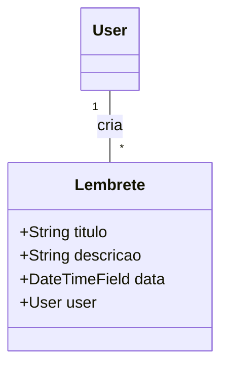
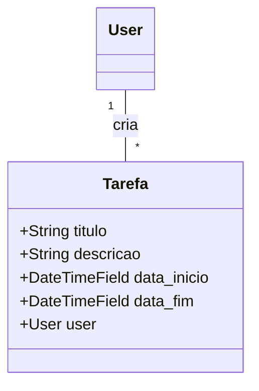
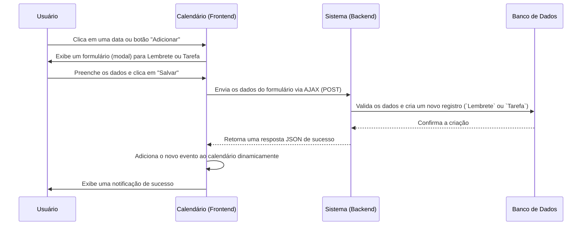

# 🧾 App: Agenda (Agenda Pessoal)

O app `agenda` é um módulo de produtividade pessoal integrado ao SisCoE. Ele fornece a cada usuário uma ferramenta privada para criar e gerenciar seus próprios **Lembretes** (eventos pontuais) e **Tarefas** (atividades com duração), ajudando na organização de compromissos e atividades diárias.

---

## 📋 Visão Geral

O propósito do app é oferecer uma agenda digital funcional e integrada ao sistema, onde cada militar pode organizar seus compromissos pessoais e profissionais de forma privada e segura.

- 🎯 **Organização Pessoal**: Permite o cadastro de lembretes e tarefas com data, hora e descrição.
- 📅 **Visualização em Calendário**: Apresenta todos os compromissos em uma interface de calendário interativa.
- ⚡ **Interface Dinâmica (AJAX)**: A criação e exclusão de eventos são feitas de forma assíncrona, sem recarregar a página, para uma experiência de usuário mais fluida.
- 🔔 **Notificações**: Possui um endpoint para consultar eventos próximos, permitindo que a interface exiba alertas ao usuário.

---

## 🗂️ Modelos de Dados

A `agenda` utiliza dois modelos simples, ambos estritamente vinculados ao usuário que os criou.

### Lembrete
Usado para eventos pontuais que ocorrem em uma data e hora específicas.

```python
class Lembrete(models.Model):
    titulo = models.CharField(max_length=200)
    descricao = models.TextField()
    data = models.DateTimeField()
    user = models.ForeignKey(User, on_delete=models.CASCADE)
```



### Tarefa
Usado para atividades que têm uma duração, com data de início e fim.

```python
class Tarefa(models.Model):
    titulo = models.CharField(max_length=200)
    descricao = models.TextField()
    data_inicio = models.DateTimeField()
    data_fim = models.DateTimeField()
    user = models.ForeignKey(User, on_delete=models.CASCADE)
```



---

## 🔄 Fluxo de Trabalho

O fluxo principal é a interação do usuário com seu calendário pessoal para adicionar um novo compromisso.



---

## 🎯 Funcionalidades Principais

- **Visualização em Calendário**: A view `calendario` renderiza uma interface de calendário (usando FullCalendar.js) que exibe todos os lembretes e tarefas do usuário.
- **Criação Rápida (AJAX)**: As views `lembrete_novo` e `tarefa_nova` permitem a criação de eventos de forma assíncrona, sem recarregar a página.
- **Edição de Eventos**: Views `lembrete_editar` e `tarefa_editar` para modificar compromissos existentes.
- **Exclusão Rápida (AJAX)**: As views `excluir_lembrete` e `excluir_tarefa` permitem remover eventos do calendário dinamicamente.
- **API de Eventos Próximos**: O endpoint `eventos_proximos` retorna um JSON com os compromissos das próximas 48 horas, usado para alimentar um sistema de notificação na interface.

---

## 🔗 Relacionamentos

O app `agenda` é quase totalmente autocontido. Seu único relacionamento externo é com o app `accounts`.

- **`accounts`**: Os modelos `Lembrete` e `Tarefa` possuem uma `ForeignKey` para o `User`, garantindo que cada evento pertença a um único usuário e seja privado.
  ```python
  # Em ambos os modelos
  user = models.ForeignKey(User, on_delete=models.CASCADE)
  ```

---

## 🛡️ Controles de Acesso e Validações

- **Acesso**: Todas as views do app `agenda` são protegidas com o decorador `@login_required`, garantindo que apenas usuários autenticados possam acessar suas funcionalidades.
- **Privacidade de Dados**: Todas as queries ao banco de dados são estritamente filtradas pelo `request.user`. Um usuário não pode, em hipótese alguma, ver, editar ou excluir os eventos de outro usuário.
  ```python
  # Exemplo de query segura
  lembretes = Lembrete.objects.filter(user=request.user)
  ```
- **Validação de Datas**: O modelo `Tarefa` possui uma validação (`clean` method) que impede que a data de término seja anterior à data de início.

---

## 📈 Métricas e Estatísticas

Por ser um app de produtividade pessoal, a `agenda` não gera métricas de BI para o sistema. As únicas "métricas" são para o próprio usuário:

- **Contagem de Eventos**: A interface pode exibir o número de lembretes e tarefas para um determinado dia ou semana.
- **Notificações**: A funcionalidade de `eventos_proximos` serve como um indicador de compromissos iminentes.

---

## 🎨 Interface do Usuário

- **`calendario.html`**: O único template principal do app. Ele renderiza a estrutura do calendário e contém os modais (pop-ups) com os formulários para adicionar e editar eventos.
- **Componentes Visuais**:
  - **Calendário Interativo**: O componente principal, que permite arrastar e soltar eventos, clicar em datas para criar novos, e clicar em eventos existentes para ver detalhes.
  - **Modais de Formulário**: Formulários para `Lembrete` e `Tarefa` que aparecem sobre a tela, evitando a necessidade de navegar para outra página.

---

## 🔧 Configuração Técnica

**URLs Principais**
```python
app_name = 'agenda'

urlpatterns = [
    path('calendario/', views.calendario, name='calendario'),
    path('lembrete/novo/', views.lembrete_novo, name='lembrete_novo'),
    path('tarefa/nova/', views.tarefa_nova, name='tarefa_nova'),
    path('lembrete/excluir/<int:pk>/', views.excluir_lembrete, name='excluir_lembrete'),
    path('eventos-proximos/', views.eventos_proximos, name='eventos_proximos'),
]
```

**Dependências**
- **FullCalendar.js** (biblioteca JavaScript): Embora não seja uma dependência do Django, é a tecnologia fundamental no frontend para a renderização do calendário.

---

## 💡 Casos de Uso

**Cenário Típico**: Um militar precisa se lembrar de uma reunião importante na próxima semana. Ele acessa sua agenda, clica no dia da reunião, e um modal para "Novo Lembrete" aparece. Ele preenche o título, a descrição e a hora, e salva. O evento aparece instantaneamente em seu calendário, sem que a página seja recarregada. No dia da reunião, a página inicial do SisCoE exibe um alerta no canto da tela, notificando-o sobre o compromisso iminente.

**Benefícios**:
- **🎯 Organização**: Ajuda o militar a gerenciar seu tempo e a não perder compromissos.
- **⚙️ Usabilidade**: A interface moderna e dinâmica (AJAX) torna o uso da agenda rápido e agradável.
- **📊 Privacidade**: Garante que os compromissos de cada usuário sejam privados e acessíveis apenas por ele.
- **📈 Integração**: Por estar dentro do SisCoE, a agenda se beneficia do sistema de login e pode ser acessada facilmente a partir de qualquer ponto do sistema.