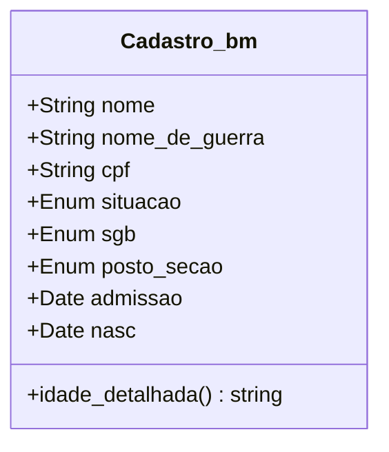
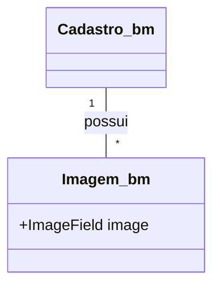

# 🧾 App: BM (Gestão de Bombeiros Municipais)

O app `bm` é o módulo do SisCoE dedicado ao cadastro e gerenciamento de pessoal dos **Bombeiros Municipais**. Ele funciona como um sistema de registro de RH completo e autocontido, paralelo ao app `efetivo` (que gerencia os militares estaduais).

---

## 📋 Visão Geral

O propósito do app é centralizar e padronizar as informações cadastrais dos bombeiros que atuam nos municípios conveniados, garantindo que o comando tenha uma visão clara e atualizada desse efetivo.

- 🎯 **Cadastro Centralizado**: Mantém um registro único para cada bombeiro municipal, com dados pessoais, de contato, funcionais e de lotação.
- 🖼️ **Gestão de Imagens**: Permite associar uma foto de perfil a cada cadastro.
- 📊 **CRUD Completo**: Oferece funcionalidades para criar, listar, visualizar, editar e excluir registros.
- 🔄 **Gestão em Massa**: Inclui ferramentas poderosas para importação e exportação de dados em lote (CSV, Excel, PDF).

---

## 🗂️ Modelos de Dados

A arquitetura de dados é simples e focada em dois modelos principais.

### Cadastro_bm
É o modelo central que armazena todos os dados de um bombeiro municipal.

```python
class Cadastro_bm(models.Model):
    nome = models.CharField(max_length=50)
    nome_de_guerra = models.CharField(max_length=20)
    situacao = models.CharField(max_length=30, choices=situacao_choices, default="Efetivo")
    sgb = models.CharField(max_length=9, choices=sgb_choices)
    posto_secao = models.CharField(max_length=100, choices=posto_secao_choices)
    cpf = models.CharField(max_length=14, unique=True)
    admissao = models.DateField()
    nasc = models.DateField()
    # ... outros campos de contato e funcionais
```



### Imagem_bm
Armazena a foto de perfil associada a um `Cadastro_bm`.

```python
class Imagem_bm(models.Model):
    cadastro = models.ForeignKey(Cadastro_bm, on_delete=models.CASCADE, related_name='imagens')
    image = models.ImageField(upload_to='img/fotos_bm')
    user = models.ForeignKey(get_user_model(), on_delete=models.CASCADE)
```



---

## 🔄 Fluxo de Trabalho

O fluxo principal é o de gerenciamento de cadastros por um operador de RH.

```mermaid
flowchart TD
    A[Acessar Lista de BMs] --> B{Ação?}
    B --Cadastrar Novo--> C[Preencher formulário `cadastrar_bm`]
    C --> D[Salvar no Banco de Dados]
    D --> A
    B --Editar Existente--> E[Acessar `ver_bm` e clicar em Editar]
    E --> F[Modificar dados no formulário `editar_bm`]
    F --> D
    B --Exportar Dados--> G[Selecionar formato (PDF, Excel)]
    G --> H[Download do arquivo]
    H --> A
```

---

## 🎯 Funcionalidades Principais

- **Listagem e Visualização**: A view `listar_bm` exibe todos os bombeiros municipais em uma tabela, enquanto a `ver_bm` mostra uma ficha detalhada com todos os dados e a foto do indivíduo.
- **Cadastro e Edição**: Formulários completos para adicionar novos bombeiros ou atualizar informações existentes.
- **Atualização de Foto**: Funcionalidade dedicada (`atualizar_foto`) para trocar a imagem de perfil de um bombeiro.
- **Exclusão Segura**: A exclusão de um registro (`excluir_bm`) requer a senha do usuário logado como medida de segurança para evitar remoções acidentais.
- **Importação em Massa**: A view `importar_bm` permite o upload de um arquivo CSV ou Excel para cadastrar múltiplos bombeiros de uma vez, com validação de colunas e dados.
- **Exportação de Relatórios**: A funcionalidade `exportar_bm` gera relatórios do efetivo em PDF, Excel (XLSX) e CSV.

---

## 🔗 Relacionamentos

O app `bm` é em grande parte autocontido. Seu único relacionamento externo é com o app `accounts`:

- **`accounts`**: Os modelos `Cadastro_bm` e `Imagem_bm` possuem uma `ForeignKey` para o `User`, registrando qual usuário realizou a criação ou a última alteração do registro.
  ```python
  # Em Cadastro_bm e Imagem_bm
  user = models.ForeignKey(get_user_model(), on_delete=models.CASCADE)
  ```

---

## 🛡️ Controles de Acesso e Validações

| View | Permissão Requerida | Acesso |
| :--- | :--- | :--- |
| `listar_bm` | Autenticação | Usuários com permissão de SGB ou superior |
| `cadastrar_bm` | `bm.add_cadastro_bm` | Gestores e Admin |
| `editar_bm` | `bm.change_cadastro_bm` | Gestores e Admin |
| `excluir_bm` | `bm.delete_cadastro_bm` | Gestores e Admin |
| `importar_bm` | `is_superuser` | Apenas Superusuários |

- **✅ Filtro por SGB**: A lista principal de bombeiros (`listar_bm`) é filtrada para que usuários com permissão de SGB vejam apenas os bombeiros do seu Subgrupamento.
- **✅ CPF Único**: O banco de dados impõe uma restrição de unicidade (`unique=True`) no campo `cpf` para evitar cadastros duplicados.
- **✅ Confirmação de Exclusão**: A exclusão de um registro exige a senha do usuário, prevenindo ações irreversíveis acidentais.

---

## 📈 Métricas e Estatísticas

- **Cálculo de Idade e Tempo de Serviço**: O modelo `Cadastro_bm` possui `@property` methods (`idade_detalhada`, `admissao_detalhada`) que calculam dinamicamente a idade e o tempo de serviço do bombeiro em anos, meses e dias.
- **Contagem de Efetivo**: A view `dashboard` do app `core` consulta o `Cadastro_bm` para obter o número total de bombeiros municipais ativos e incluir essa métrica nos indicadores gerais do sistema.

---

## 🎨 Interface do Usuário

- **`listar_bm.html`**: Tabela principal com a lista de todos os bombeiros, com opções de busca e filtros.
- **`ver_bm.html`**: Ficha completa do bombeiro, exibindo todos os seus dados cadastrais, foto e botões de ação (Editar, Excluir, etc.).
- **`cadastro_bm.html`**: Formulário para a criação de um novo registro.
- **`importar_bm.html`**: Página com o formulário de upload de arquivos para a importação em massa.

---

## 🔧 Configuração Técnica

**URLs Principais**
```python
app_name = 'bm'

urlpatterns = [
    path('', views.listar_bm, name='listar_bm'),
    path('cadastrar/', views.cadastrar_bm, name='cadastrar_bm'),
    path('ver/<int:pk>/', views.ver_bm, name='ver_bm'),
    path('editar/<int:pk>/', views.editar_bm, name='editar_bm'),
    path('importar/', views.importar_bm, name='importar_bm'),
    path('exportar/', views.exportar_bm, name='exportar_bm'),
]
```

**Dependências**
- `pandas`: Utilizado na view `importar_bm` para ler e processar os arquivos CSV e Excel.
- `openpyxl` e `XlsxWriter`: Necessárias para o `pandas` manipular arquivos Excel.

---

## 💡 Casos de Uso

**Cenário Típico**: O RH de um município conveniado envia uma planilha com os dados de 5 novos bombeiros contratados. Um gestor do 15ºGBM acessa a funcionalidade "Importar BM", faz o upload da planilha e o sistema automaticamente cria os 5 novos cadastros. Em seguida, o gestor acessa a lista, localiza um dos novos bombeiros e utiliza a função "Atualizar Foto" para adicionar sua imagem de perfil.

**Benefícios**:
- **🎯 Organização**: Mantém um cadastro específico e separado para o efetivo municipal, sem misturar com os dados dos militares estaduais.
- **⚙️ Agilidade**: As ferramentas de importação e exportação agilizam drasticamente a gestão de dados em massa.
- **📊 Controle**: Fornece ao comando uma visão clara do quantitativo e da distribuição dos bombeiros municipais na área do grupamento.
- **📈 Padronização**: Garante que todos os dados dos bombeiros municipais sejam coletados e armazenados no mesmo formato.