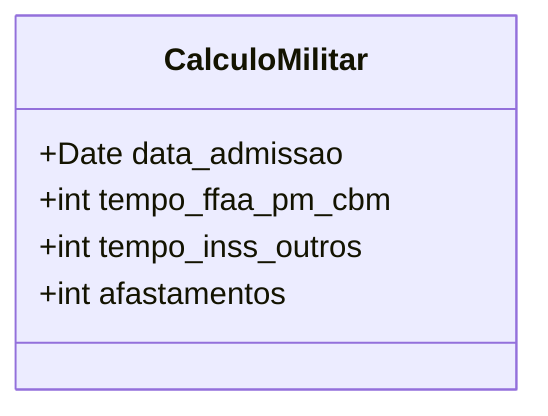
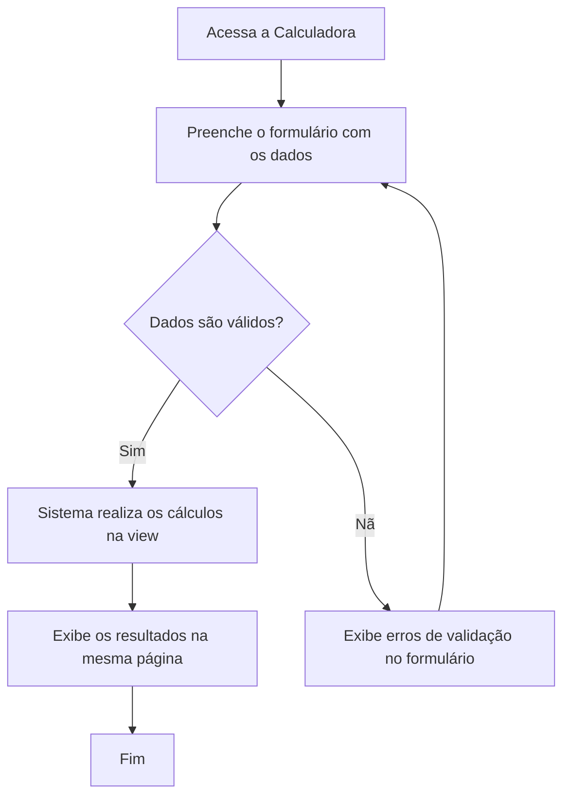

# 🧾 App: Calculadora (Projeção de Tempo de Serviço)

O app `calculadora` é uma ferramenta utilitária do SisCoE projetada para uma finalidade específica: calcular o tempo de serviço e as projeções de aposentadoria de um militar com base em regras de transição, pedágios e averbações.

---

## 📋 Visão Geral

O propósito do app é desmistificar e simplificar o cálculo de tempo para a inatividade, que pode ser complexo devido a mudanças na legislação. Ele serve como uma ferramenta de autoatendimento para que qualquer militar possa estimar datas importantes em sua carreira.

- 🎯 **Cálculo de Aposentadoria**: Projeta datas de aposentadoria com base em diferentes regras (ex: pedágio de 17%).
- 📅 **Simulação de Cenários**: Permite ao usuário inserir diferentes tempos de averbação e afastamentos para simular cenários.
-  simplified **Interface Simples**: Oferece uma única tela onde o usuário insere os dados e obtém os resultados instantaneamente.
- 🧠 **Lógica Encapsulada**: Centraliza as regras de cálculo de tempo de serviço em um único local, garantindo consistência.

---

## 🗂️ Modelos de Dados

O app utiliza um único modelo, `CalculoMilitar`, que funciona primariamente como uma estrutura para receber e validar os dados do formulário, não para armazenamento persistente de histórico de cálculos.

```python
class CalculoMilitar(models.Model):
    data_admissao = models.DateField(verbose_name="Data de Admissão do Militar")
    tempo_ffaa_pm_cbm = models.IntegerField(verbose_name="Averbação FFAA/PM/CBM (dias)", default=0)
    tempo_inss_outros = models.IntegerField(verbose_name="Averbação INSS/Outros Órgãos (dias)", default=0)
    afastamentos = models.IntegerField(verbose_name="Afastamentos Descontáveis (dias)", default=0)
```



---

## 🔄 Fluxo de Trabalho

O fluxo de interação do usuário com a calculadora é direto e linear.



---

## 🎯 Funcionalidades Principais

- **Formulário de Entrada**: Interface clara para o usuário inserir os quatro dados necessários para o cálculo: data de admissão, averbações (FFAA/PM/CBM e INSS) e dias de afastamento.
- **Cálculo de Tempo de Serviço**: A view `calcular_tempo_servico` processa os dados e calcula diversas métricas, como o tempo total de serviço em uma data de corte (01/01/2021).
- **Projeção com Pedágio de 17%**: Calcula o tempo adicional que o militar deve cumprir com base no tempo que faltava para atingir 30 anos de serviço na data de corte.
- **Projeção por Tempo Militar**: Calcula uma data alternativa para aposentadoria com base em 25 anos de serviço mais acréscimos anuais.

---

## 🔗 Relacionamentos

O app `calculadora` é um módulo **independente** e não possui relacionamentos diretos (via `ForeignKey` ou outros) com os demais apps do sistema, como `efetivo` ou `accounts`. Ele funciona como uma ferramenta de utilidade isolada.

---

## 🛡️ Controles de Acesso e Validações

- **Acesso**: A calculadora é de acesso público para qualquer usuário autenticado no sistema, não exigindo permissões especiais.
- **Validações**: 
  - **✅ Limite de Averbação INSS**: O sistema aplica uma regra de negócio que limita o tempo de averbação do INSS a um máximo de 1825 dias (5 anos) para o cálculo.
  - **✅ Validação de Formulário**: Utiliza um `ModelForm` do Django (`CalculoMilitarForm`) para garantir que os dados inseridos (como a data de admissão) sejam válidos.

---

## 📈 Métricas e Estatísticas

O app não gera métricas persistentes, mas calcula os seguintes **indicadores de projeção** para o usuário:

- **`tempo_01jan21`**: Total de dias de serviço na data de corte da reforma.
- **`pedagio_17`**: Total de dias de pedágio a serem cumpridos.
- **`data_30anos_pedagio`**: Data final projetada para aposentadoria pela regra do pedágio.
- **`data_tempo_militar`**: Data final projetada pela regra de 25 anos + acréscimos.

---

## 🎨 Interface do Usuário

- **`calculadora/calculo.html`**: É o único template do app. Ele contém tanto o formulário para entrada de dados quanto a seção que exibe os resultados do cálculo após a submissão.
- **Componentes Visuais**: A interface é simples, focada na usabilidade, com um formulário claro e uma área de resultados que apresenta cada projeção de forma legível.

---

## 🔧 Configuração Técnica

**URLs Principais**
```python
app_name = 'calculadora'

urlpatterns = [
    path('', v.calcular_tempo_servico, name='calcular_tempo_servico'),
]
```

**Dependências**: Nenhuma dependência externa. O app utiliza apenas funcionalidades nativas do Django e do Python (`datetime`).

---

## 💡 Casos de Uso

**Cenário Típico**: Um militar que ingressou na corporação em 15/03/1998 e possui 300 dias de tempo de serviço averbado de outras forças deseja saber quando poderá se aposentar. Ele acessa a calculadora, preenche sua data de admissão e o tempo averbado. O sistema exibe as datas projetadas, incluindo a data com o pedágio de 17%, permitindo que ele se planeje financeiramente e profissionalmente para a inatividade.

**Benefícios**:
- **🎯 Transparência**: Fornece clareza sobre as complexas regras de transição da aposentadoria.
- **⚙️ Autoatendimento**: Permite que o próprio militar faça suas simulações sem precisar abrir um processo formal no RH.
- **📊 Planejamento**: Ajuda no planejamento de carreira e de vida do militar.
- **📈 Padronização**: Garante que o cálculo seja feito sempre da mesma forma, evitando erros manuais.