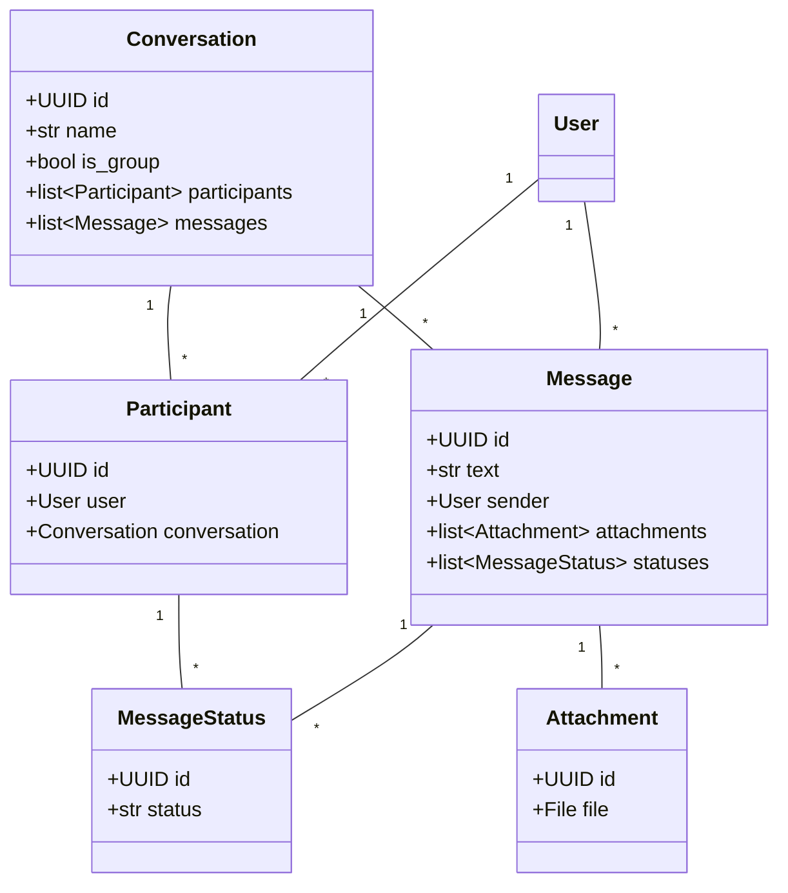
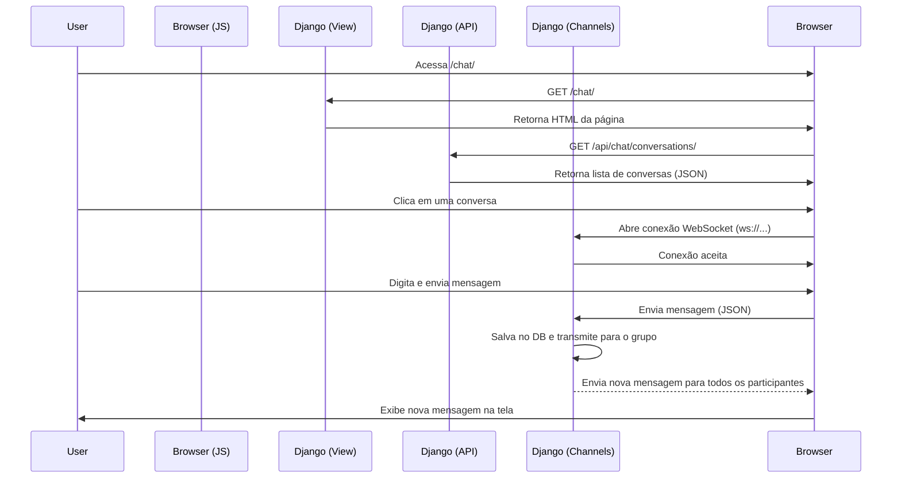

# 🧾 App: Chat em Tempo Real

## 📋 Visão Geral

O aplicativo `chat` implementa um sistema de mensagens em tempo real, similar ao WhatsApp, permitindo conversas privadas (1:1) e em grupo. A comunicação é feita via WebSockets para instantaneidade, com uma API RESTful para gerenciar o histórico e a estrutura das conversas.

## 🗂️ Modelos de Dados (Models)

A estrutura de dados é composta por cinco modelos principais que se relacionam para formar o sistema de chat.

```python
# backend/chat/models.py

class Conversation(models.Model):
    # ... (conversa 1:1 ou em grupo)

class Participant(models.Model):
    # ... (relaciona User e Conversation)

class Message(models.Model):
    # ... (uma mensagem, com texto e remetente)

class Attachment(models.Model):
    # ... (arquivos de uma mensagem)

class MessageStatus(models.Model):
    # ... (status de entrega/leitura por participante)
```



## 🔄 Fluxo de Trabalho (Workflow)

O fluxo de comunicação em tempo real é orquestrado pelo Django Channels.

1.  **Conexão HTTP**: O usuário acessa a página `/chat/`.
2.  **Frontend JS**: O JavaScript busca a lista de conversas via API REST (`/api/chat/conversations/`).
3.  **Seleção de Conversa**: O usuário clica em uma conversa.
4.  **Conexão WebSocket**: O JS inicia uma conexão WebSocket para `ws/chat/{conversation_id}/`.
5.  **Autenticação (Channels)**: O `AuthMiddlewareStack` autentica o usuário na conexão WebSocket.
6.  **Conexão do Consumidor**: O `ChatConsumer` aceita a conexão se o usuário for um participante válido.
7.  **Envio de Mensagem**: O usuário digita e envia uma mensagem.
8.  **Recebimento no Consumidor**: O `ChatConsumer` recebe a mensagem, salva no banco de dados e a transmite para todos os participantes no grupo do canal.
9.  **Recebimento no Frontend**: O JS de cada participante recebe a nova mensagem e a adiciona à interface.



## 🎯 Funcionalidades

- **Conversas**: Listagem de conversas do usuário.
- **Mensagens**: Envio e recebimento de mensagens de texto em tempo real.
- **API REST**: Endpoints para gerenciamento de conversas e mensagens.
- **Autenticação**: Acesso à página e ao WebSocket restrito a usuários autenticados.

## 🔧 Configuração Técnica

### Dependências

- `django-rest-framework`: Para a API REST.
- `channels`: Habilita o suporte a WebSocket e ASGI.
- `channels_redis`: Fornece o backend do Channel Layer para produção.
- `daphne`: Servidor de aplicação ASGI.
- `drf-nested-routers`: Para criar URLs de API aninhadas.

### URLs

- **Página do Chat**: `/chat/`
- **API de Conversas**: `/api/chat/conversations/`
- **API de Mensagens**: `/api/chat/conversations/{conversation_pk}/messages/`
- **WebSocket**: `ws/chat/{conversation_id}/`

## 💡 Casos de Uso

- **Comunicação Interna**: Ferramenta de chat para equipes.
- **Suporte ao Cliente**: Canal de comunicação direto com clientes.
- **Integração Mobile**: A API REST pode ser consumida por um aplicativo móvel para uma experiência nativa.
