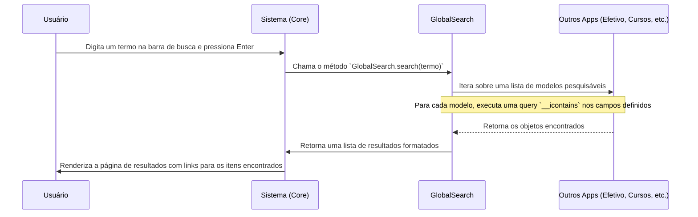

# 🧾 App: Core (Orquestrador Central do Sistema)

O app `core` é o coração do SisCoE. Diferente de outros apps que gerenciam um domínio de negócio específico (como `efetivo` ou `cursos`), o `core` não possui modelos de dados próprios. Sua função é orquestrar a interface principal, agregar informações de múltiplos apps e fornecer funcionalidades transversais que se aplicam a todo o sistema.

---

## 📋 Visão Geral

O propósito do `core` é ser o ponto de entrada e a principal camada de apresentação para o usuário. Ele é responsável por criar uma experiência de usuário coesa, reunindo dados de diferentes partes do sistema em um único local.

- 🎯 **Páginas Principais**: Fornece as views para a página de entrada (`landing.html`), a página inicial pós-login (`index.html`) e o dashboard de BI.
- 🔍 **Busca Global**: Contém a lógica da barra de pesquisa global, que busca informações em todos os apps do sistema.
- 📅 **Funcionalidades Comuns**: Apresenta o calendário de eventos, feriados e aniversários.
- 🧠 **Middleware**: Inclui middlewares que operam em todas as requisições, como o que injeta mensagens do Django em respostas JSON (útil para AJAX/HTMX).
- 📊 **Agregação de Dados**: Suas views consultam múltiplos apps (`efetivo`, `agenda`, `documentos`, `municipios`) para construir os dashboards e a página inicial.

---

## 🗂️ Modelos de Dados

O app `core` **não possui modelos de dados próprios**. Ele é um app de lógica e apresentação, e todos os dados que ele exibe são consultados dos modelos de outros apps.

---

## 🔄 Fluxo de Trabalho

O fluxo mais importante gerenciado pelo `core` é o da **Busca Global**.



---

## 🎯 Funcionalidades Principais

- **Página Inicial (`index`)**: Uma view complexa que agrega aniversariantes do mês, documentos recentes, lembretes e tarefas do usuário, e a hierarquia de comando, consultando os apps `efetivo`, `agenda` e `documentos`.
- **Dashboard de BI (`dashboard_view`)**: Exibe métricas consolidadas sobre o efetivo, como total fixado vs. existente, percentual de "claro" (vagas), e distribuição por SGB. Consulta os apps `efetivo`, `municipios` e `bm`.
- **Busca Global (`global_search_view`)**: Utiliza a classe `GlobalSearch` para realizar uma busca textual em mais de 20 modelos de diferentes apps, retornando uma lista unificada de resultados.
- **Calendário de Eventos (`CalendarioView`)**: Exibe um calendário com eventos do grupamento e feriados (nacionais, estaduais e municipais) que são pré-definidos diretamente na view.

---

## 🔗 Relacionamentos

O app `core` não possui modelos, portanto não tem `ForeignKey` ou outros relacionamentos de banco de dados. No entanto, ele possui **dependências lógicas** com quase todos os outros apps, pois suas views importam e consultam os modelos deles para agregar dados. Os principais apps consumidos são:

- `efetivo` (para aniversariantes, hierarquia de comando, métricas do dashboard)
- `documentos` (para a lista de documentos recentes)
- `agenda` (para lembretes e tarefas do usuário)
- `municipios` e `bm` (para os totais de efetivo no dashboard)

---

## 🛡️ Controles de Acesso e Validações

O `core` utiliza os decoradores de permissão definidos em `accounts.decorators` para proteger suas views mais sensíveis.

| View | Permissão Requerida | Acesso |
| :--- | :--- | :--- |
| `index` / `capa` | Autenticação (para `index`) | Todos os usuários logados |
| `dashboard_view` | `admin` (implícito na lógica) | Gestores e Admin |
| `global_search_view` | Autenticação | Todos os usuários logados |

- **✅ Filtro por SGB**: As views como `index` aplicam filtros (`filter_by_user_sgb`) para que usuários com permissão de SGB vejam apenas dados (como aniversariantes) do seu próprio Subgrupamento.

---

## 📈 Métricas e Estatísticas

A view `dashboard_view` é a principal central de métricas do sistema, calculando em tempo real:

- **Efetivo Fixado vs. Existente**: Compara o total de vagas (`Pessoal`) com o total de militares ativos (`Cadastro`).
- **Percentual de Claro**: Calcula a porcentagem de vagas não preenchidas.
- **Distribuição por SGB**: Agrupa o efetivo por Subgrupamento, mostrando o total fixado, existente e o claro para cada um.

---

## 🎨 Interface do Usuário

- **`landing.html`**: A página de entrada do sistema para usuários não autenticados.
- **`index.html`**: A página principal do sistema, com múltiplos componentes como cards de aniversariantes, lista de documentos e carrossel de imagens.
- **`dashboard.html`**: Template que renderiza os gráficos e tabelas de BI, utilizando `Chart.js` para visualização de dados.
- **`global_search/results.html`**: Página que exibe os resultados da busca global, agrupados por app.

---

## 🔧 Configuração Técnica

**URLs Principais**
```python
app_name = 'core'

urlpatterns = [
    path('home', index, name='index'),
    path('', capa, name='capa'),
    path('dashboard/', dashboard_view, name='dashboard'),
    path('calendario/', CalendarioView.as_view(), name='calendario'),
    path('search/', global_search_view, name='global_search'),
]
```

**Dependências**: O `core` não introduz novas dependências de pacotes, mas depende funcionalmente de quase todos os outros apps do projeto.

---

## 💡 Casos de Uso

**Cenário Típico**: Um comandante de SGB faz login no sistema. A view `index` do app `core` é chamada. Ela busca os aniversariantes do seu SGB no app `efetivo`, suas tarefas no app `agenda` e os últimos documentos no app `documentos`. Todas essas informações são renderizadas de forma organizada na sua página inicial. Em seguida, ele usa a barra de busca global para procurar por um militar específico pelo nome, e o `GlobalSearch` retorna um link direto para o perfil do militar no app `efetivo`.

**Benefícios**:
- **🎯 Visão Unificada**: Agrega as informações mais importantes de todo o sistema em um único local.
- **⚙️ Navegação Centralizada**: Serve como o principal ponto de navegação para as demais funcionalidades do SisCoE.
- **📊 Inteligência de Negócio**: O dashboard fornece aos gestores uma visão macro e imediata da situação do efetivo.
- **📈 Eficiência**: A busca global economiza tempo, permitindo encontrar qualquer informação no sistema rapidamente.