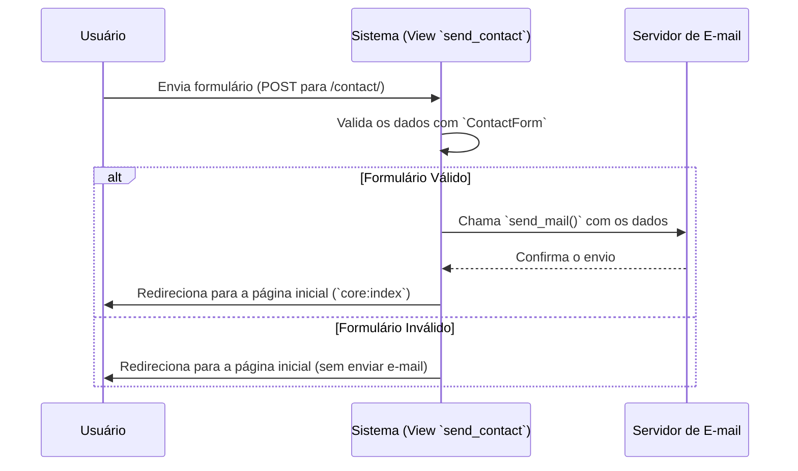

# 🧾 App: CRM (Módulo de Contato)

O app `crm`, em seu estado atual no projeto SisCoE, funciona como um micro-serviço para uma única finalidade: processar e enviar os dados de um **formulário de contato** por e-mail.

---

## 📋 Visão Geral

O propósito do app é fornecer um endpoint único e isolado para capturar mensagens enviadas através de um formulário de contato (por exemplo, em uma página "Fale Conosco") e encaminhá-las para um destinatário de e-mail pré-definido.

- 🎯 **Formulário de Contato**: Sua única função é receber e processar dados de um formulário com nome, e-mail, título e mensagem.
- 📧 **Envio de E-mail**: Utiliza o sistema de e-mail do Django para enviar o conteúdo do formulário.
- 🚪 **Endpoint Único**: Expõe uma única URL (`/contact/`) para receber os dados.
- ❌ **Sem Persistência de Dados**: O app não possui modelos de dados e não armazena nenhuma informação no banco de dados.

!!! warning "Funcionalidade Atual vs. Nome"
    O nome "CRM" (Customer Relationship Management) geralmente implica um sistema complexo de gestão de contatos, interações e funis de venda. A funcionalidade atual é muito mais simples, limitada a um formulário de contato.

---

## 🗂️ Modelos de Dados

O app `crm` **não possui modelos de dados** (`models.py` está vazio). Toda a informação recebida é processada e enviada por e-mail, sem ser salva no banco de dados do sistema.

---

## 🔄 Fluxo de Trabalho

O fluxo de operação é linear e executado em uma única requisição.



---

## 🎯 Funcionalidades Principais

- **Validação de Formulário**: Utiliza um `ContactForm` do Django para validar os campos `name`, `email`, `title` e `body` enviados na requisição.
- **Envio de E-mail**: Se a validação for bem-sucedida, a view `send_contact` monta e envia um e-mail contendo a mensagem do usuário.

---

## 🔗 Relacionamentos

O app `crm` é **totalmente independente** e não possui relacionamentos com nenhum outro app do sistema.

---

## 🛡️ Controles de Acesso e Validações

- **Acesso**: O endpoint `/contact/` é público e não requer autenticação. Ele é protegido apenas pela restrição de aceitar somente requisições do tipo `POST`.
- **Validações**: A única validação é a do `ContactForm`, que verifica se os campos foram preenchidos e se o e-mail do remetente tem um formato válido.

---

## 📈 Métricas e Estatísticas

Este app não gera nem armazena dados, portanto não há métricas ou estatísticas associadas a ele.

---

## 🎨 Interface do Usuário

O app `crm` não possui templates próprios. Ele apenas processa os dados de um formulário que deve ser renderizado por outro app (provavelmente o `core`, em uma página de contato).

---

## 🔧 Configuração Técnica

**URLs Principais**
```python
app_name = 'crm'

urlpatterns = [
    path('contact/', v.send_contact, name='send_contact'),
]
```

**Dependências**: Nenhuma dependência externa. Utiliza apenas o `send_mail` nativo do Django.

!!! danger "Configuração Crítica de Produção"
    A view `send_contact` está atualmente configurada para enviar e-mails para `['localhost']`. Para que o formulário funcione em produção, este endereço **precisa ser alterado** para o e-mail do destinatário real.

    ```python
    # crm/views.py
    send_mail(
        subject, message, sender,
        ['email_real@dominio.com'], # <-- ALTERAR AQUI
        fail_silently=False,
    )
    ```

---

## 💡 Casos de Uso

**Cenário Típico**: Um visitante externo acessa a página "Fale Conosco" do portal SisCoE, preenche o formulário com seu nome, e-mail e uma pergunta, e clica em "Enviar". O navegador envia os dados para o endpoint `/contact/` do app `crm`. O app valida os dados, monta um e-mail com a pergunta do visitante e o envia para a caixa de entrada do administrador do sistema. O visitante é então redirecionado para a página inicial.

**Benefícios**:
- **🎯 Simplicidade**: Oferece uma maneira simples e direta de receber contato externo.
- **⚙️ Desacoplamento**: Isola a lógica de envio de e-mail de contato em um app dedicado.