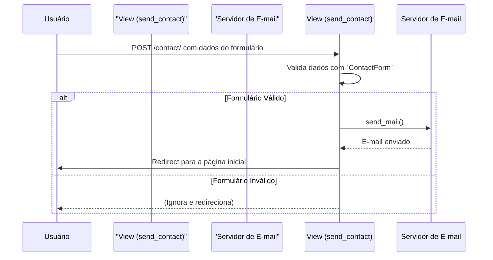

# App: CRM

Apesar do nome, o app `crm` no SisCoE atualmente serve a um propósito muito específico e contido: ele funciona como um **módulo de formulário de contato**.

Sua única responsabilidade é fornecer um endpoint para receber dados de um formulário de contato e enviá-los por e-mail.

!!! info "Funcionalidade Atual vs. Nome"
    O nome "CRM" (Customer Relationship Management) sugere uma funcionalidade mais ampla, como gerenciamento de leads ou contatos. No entanto, em seu estado atual, o app não possui modelos de dados (`models.py` está vazio) e se limita a processar um formulário de contato.

---

## Fluxo de Operação

O fluxo do app é linear e simples:

1.  Um usuário (ou um sistema externo) envia uma requisição `POST` para o endpoint `/contact/`.
2.  Os dados da requisição são validados pelo `ContactForm`.
3.  Se o formulário for válido, a view `send_contact` utiliza a função `send_mail` do Django para enviar um e-mail com o conteúdo do formulário.
4.  Após o envio, o usuário é redirecionado para a página inicial (`core:index`).



---

## Componentes Principais

### Formulário (`forms.py`)

-   **`ContactForm`**: Um formulário simples do Django que define os campos esperados:
    -   `name` (CharField)
    -   `email` (EmailField)
    -   `title` (CharField)
    -   `body` (CharField com widget de Textarea)

### View (`views.py`)

-   **`send_contact(request)`**:
    -   Aceita apenas requisições `POST`.
    -   Valida os dados recebidos usando o `ContactForm`.
    -   Se válido, envia um e-mail e redireciona.

!!! warning "Configuração de Destinatário"
    Atualmente, a view `send_contact` está configurada para enviar e-mails para o destinatário `['localhost']`. Esta é uma configuração de desenvolvimento e **precisa ser alterada** para um endereço de e-mail de produção real para que a funcionalidade seja útil.

    ```python
    # crm/views.py

    send_mail(
        subject,
        message,
        sender,
        ['localhost'],  # <-- ATENÇÃO: Mudar para produção
        fail_silently=False,
    )
    ```

### URL (`urls.py`)

O app expõe um único endpoint:

-   **`path('contact/', v.send_contact, name='send_contact')`**