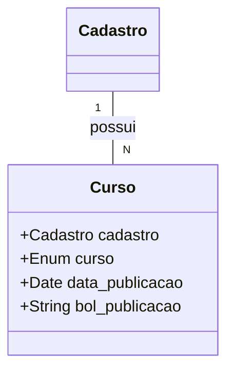
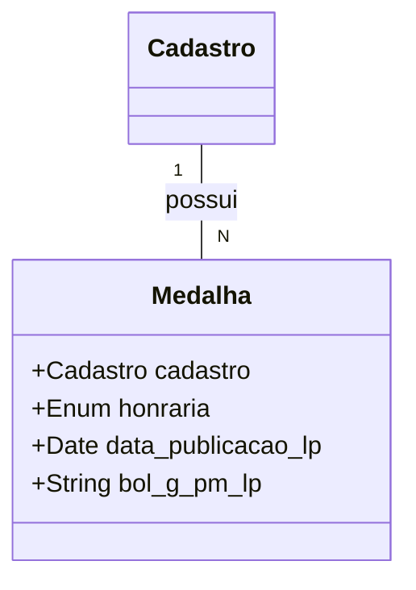
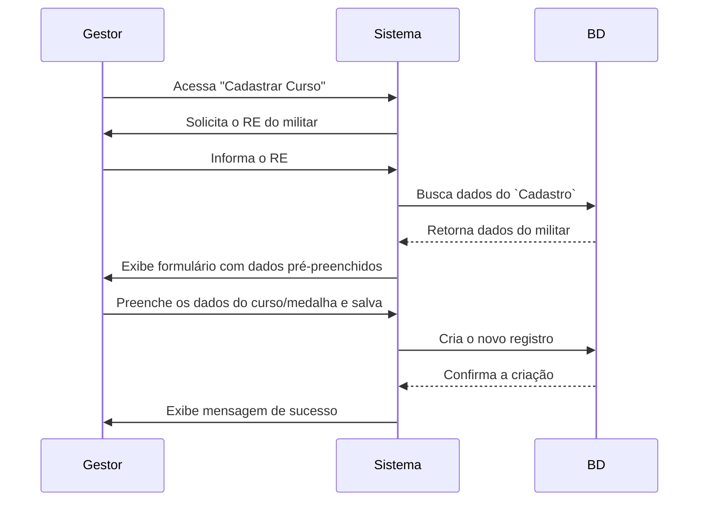

# 🧾 App: Cursos (Gestão de Qualificações e Honrarias)

O app `cursos` é o módulo do SisCoE responsável pelo registro e gerenciamento do desenvolvimento profissional e dos méritos de cada militar. Ele centraliza dois tipos de informações cruciais: **Cursos** (qualificações técnicas e de carreira) e **Medalhas** (condecorações e honrarias).

---

## 📋 Visão Geral

O propósito do app é criar um repositório único e confiável das qualificações e reconhecimentos de todo o efetivo, servindo como um currículo digital. Ele atende tanto a gestores de RH, que precisam de uma visão consolidada, quanto aos próprios militares, que podem manter seus dados atualizados.

- 🎯 **Registro Duplo**: Gerencia duas entidades distintas, Cursos e Medalhas, em um único local.
- 👤 **Autoatendimento**: Oferece uma interface para que o próprio militar possa visualizar e gerenciar seus cursos e medalhas.
- 🛠️ **Gestão Administrativa**: Fornece ferramentas para que o RH (B/1) possa cadastrar, editar e auditar os registros de todo o efetivo.
- 🔄 **Importação/Exportação**: Facilita a carga e extração de dados em massa através da integração com `django-import-export`.

---

## 🗂️ Modelos de Dados

O app é estruturado em torno de dois modelos principais, ambos ligados ao `Cadastro` do militar.

### Curso
Armazena os registros de cursos e qualificações concluídas.

```python
class Curso(models.Model):
    CURSOS_CHOICES = (
        ('Atendimento Pré-Hospitalar Tático', 'Atendimento Pré-Hospitalar Tático'),
        # ... (lista de cursos)
    )

    cadastro = models.ForeignKey(Cadastro, on_delete=models.CASCADE, related_name='cursos')
    curso = models.CharField(max_length=255, choices=CURSOS_CHOICES)
    data_publicacao = models.DateField()
    bol_publicacao = models.CharField(max_length=255)
    usuario_alteracao = models.ForeignKey(settings.AUTH_USER_MODEL, on_delete=models.SET_NULL, null=True)
```



### Medalha
Armazena as condecorações e honrarias recebidas.

```python
class Medalha(models.Model):
    HONRARIA_CHOICES = [
        ("Medalha Solidariedade de Timor-Leste", "Medalha Solidariedade de Timor-Leste"),
        # ... (lista extensa de medalhas)
    ]

    cadastro = models.ForeignKey(Cadastro, on_delete=models.DO_NOTHING)
    honraria = models.CharField(max_length=255, choices=HONRARIA_CHOICES)
    data_publicacao_lp = models.DateField(null=True, blank=True)
    bol_g_pm_lp = models.CharField(max_length=50, null=True, blank=True)
```



---

## 🔄 Fluxo de Trabalho

Existem dois fluxos de trabalho paralelos: o do gestor (admin) e o do próprio usuário (autoatendimento).

**Fluxo de Cadastro pelo Gestor**


**Fluxo de Autoatendimento do Usuário**
```mermaid
flowchart TD
    A[Usuário acessa "Meus Cursos"] --> B[Sistema lista os cursos já cadastrados para ele]
    B --> C{Deseja adicionar um novo?}
    C --Sim--> D[Preenche o formulário de novo curso]
    D --> E[Sistema valida e salva o novo curso]
    E --> B
    C --Não--> F[Fim]
```

---

## 🎯 Funcionalidades Principais

- **CRUD Duplo**: Funcionalidades completas de Criar, Ler, Atualizar e Excluir tanto para `Curso` quanto para `Medalha`.
- **Cadastro em Lote**: A interface permite adicionar múltiplos cursos ou medalhas para o mesmo militar em uma única submissão, otimizando o tempo do operador.
- **Busca de Militar**: Antes de cadastrar, o gestor deve buscar o militar pelo seu RE, garantindo que o registro seja associado à pessoa correta.
- **Interface de Autoatendimento**: Seção dedicada ("Meus Cursos", "Minhas Medalhas") onde o usuário logado gerencia seus próprios registros.
- **Importação/Exportação via Admin**: Na interface de administração do Django, é possível importar e exportar planilhas de cursos e medalhas.

---

## 🔗 Relacionamentos

- **`efetivo` (Essencial)**: Ambos os modelos, `Curso` e `Medalha`, possuem uma relação `ForeignKey` direta com o `efetivo.Cadastro`. Este é o vínculo que conecta cada qualificação ou honraria a um militar específico.
  ```python
  # Em ambos os modelos Curso e Medalha
  cadastro = models.ForeignKey(Cadastro, on_delete=models.CASCADE)
  ```

---

## 🛡️ Controles de Acesso e Validações

| View | Permissão Requerida | Acesso |
| :--- | :--- | :--- |
| `curso_list` / `medalha_list` | `sgb` ou superior | Gestores de SGB e Admin |
| `curso_create` / `medalha_create` | `sgb` ou superior | Gestores de SGB e Admin |
| `user_curso_list` / `user_medalha_list` | Autenticação | Apenas o próprio usuário |
| `user_curso_create` / `user_medalha_create` | Autenticação | Apenas o próprio usuário |

- **✅ Validação de RE**: O fluxo de cadastro administrativo sempre começa com a busca e validação de um militar existente.
- **✅ Propriedade dos Dados**: Nas views de autoatendimento, as queries são sempre filtradas para garantir que um usuário só possa ver e manipular seus próprios dados.

---

## 📈 Métricas e Estatísticas

- **Contagem de Qualificações**: O sistema permite agregar e contar quantos militares possuem um determinado curso, útil para planejar treinamentos ou selecionar pessoal para missões específicas.
- **Tags de Cursos**: O modelo `Curso` possui um mapeamento interno (`CURSOS_TAGS`) que classifica os cursos em categorias como "Administrativo" ou "Operacional", permitindo análises estatísticas sobre o perfil de qualificação do efetivo.

---

## 🎨 Interface do Usuário

- **`curso_list.html` / `medalha_list.html`**: Tabela principal para administradores, com filtros para buscar por militar ou tipo de curso/medalha.
- **`curso_form.html` / `medalha_form.html`**: Formulário de cadastro que se inicia com a busca de um militar por RE e permite a adição dinâmica de múltiplos registros.
- **`usuario_cursos.html` / `usuario_medalha.html`**: Página de perfil onde o usuário logado vê uma lista de seus registros e tem botões para adicionar, editar ou excluir.

---

## 🔧 Configuração Técnica

**URLs Principais**
```python
app_name = 'cursos'

urlpatterns = [
    # URLs de Gestão (Admin)
    path('cursos/', views.curso_list, name='curso_list'),
    path('cursos/cadastrar/', views.curso_create, name='curso_create'),
    path('medalhas/', views.medalha_list, name='medalha_list'),

    # URLs de Autoatendimento (Usuário)
    path('meus-cursos/', views.user_curso_list, name='user_curso_list'),
    path('meus-medalhas/', views.user_medalha_list, name='user_medalha_list'),
]
```

**Dependências**
- `django-import-export`: Usada para a funcionalidade de importação e exportação na interface de administração do Django.

---

## 💡 Casos de Uso

**Cenário Típico (Gestor)**: Um oficial do B/1 precisa registrar os certificados de um curso de "Salvamento Aquático" recém-concluído por 10 bombeiros. Ele acessa a tela de cadastro de cursos, busca o primeiro militar pelo RE, e usa a função "Adicionar outro curso" para criar os 10 registros de uma vez, cada um associado ao seu respectivo militar, preenchendo a data e o boletim de publicação.

**Cenário Típico (Usuário)**: Um militar percebe que uma medalha que recebeu não consta em seu perfil. Ele acessa a seção "Minhas Medalhas", clica em "Adicionar Nova Medalha", preenche os dados conforme publicado em boletim e salva. O registro agora faz parte de seu currículo digital no SisCoE.

**Benefícios**:
- **🎯 Centralização**: Consolida o histórico profissional e de mérito do efetivo em um único local.
- **⚙️ Eficiência**: A criação em lote e as ferramentas de importação economizam tempo de digitação.
- **📊 Autonomia e Correção**: Permite que os próprios militares mantenham seus dados atualizados, melhorando a qualidade da informação.
- **📈 Análise de Competências**: Facilita a identificação de pessoal qualificado para determinadas funções ou missões.