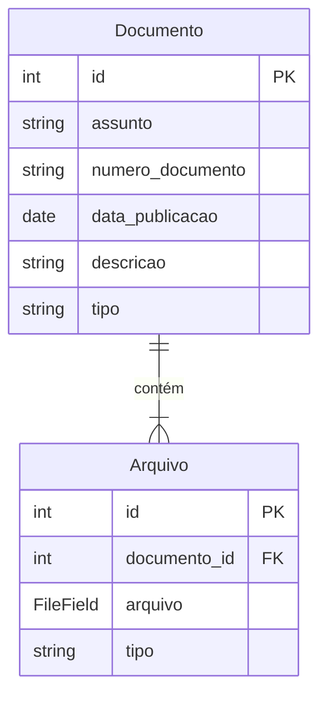

# App: Documentos

O app `documentos` funciona como o Sistema de Gerenciamento de Documentos (DMS) do SisCoE. Ele é projetado para lidar com o upload, armazenamento, categorização e visualização de arquivos e documentos relacionados às operações do sistema.

---

## Modelo de Dados

A arquitetura de dados separa de forma inteligente os metadados de um documento dos seus arquivos físicos, permitindo que um único "documento" conceitual contenha múltiplos anexos.

-   **`Documento`**: Este modelo atua como um contêiner ou uma "pasta". Ele armazena os metadados que descrevem o conjunto de arquivos, como `assunto`, `numero_documento`, `data_publicacao`, e uma `descricao` que suporta Markdown.
-   **`Arquivo`**: Representa um arquivo físico individual (`.pdf`, `.jpg`, `.mp4`, etc.). Cada registro `Arquivo` está ligado a um `Documento` e armazena o arquivo em si no sistema de arquivos (na pasta `documentos/`).

!!! abstract "Modelo `documentos.models.Documento`"
    ::: backend.documentos.models.Documento
        options:
          show_root_heading: false
          show_source: false

!!! abstract "Modelo `documentos.models.Arquivo`"
    ::: backend.documentos.models.Arquivo
        options:
          show_root_heading: false
          show_source: false

---

## Fluxo de Trabalho

### Criação de um Documento
1.  O usuário acessa a view `criar_documento`.
2.  Ele preenche os metadados do documento (assunto, número, etc.).
3.  Na mesma tela, ele pode selecionar **múltiplos arquivos** para upload. Para cada arquivo, ele define o `tipo` (PDF, Imagem, Vídeo, etc.).
4.  Ao submeter, o sistema primeiro cria o registro `Documento` e, em seguida, cria um registro `Arquivo` para cada arquivo enviado, associando todos ao `Documento` recém-criado.

### Gerenciamento de Anexos
Após a criação, os arquivos de um documento podem ser gerenciados:
-   **Adicionar**: A view `editar_documento_arquivos` permite que novos arquivos sejam anexados a um documento existente.
-   **Excluir**: A exclusão de um anexo individual é feita de forma assíncrona (via AJAX) através da view `excluir_arquivo`, proporcionando uma experiência de usuário mais fluida sem a necessidade de recarregar a página.

---

## Funcionalidades Notáveis

-   **Galeria de Documentos (`galeria_documentos`)**: Uma interface visual que exibe os documentos como "cards", mostrando seus anexos. A galeria possui filtros por assunto e data, facilitando a busca e a navegação.
-   **Visualização de Conteúdo (`carregar_conteudo_arquivo`)**: O sistema permite a visualização de certos tipos de arquivo diretamente no navegador, como PDFs e arquivos de texto, sem a necessidade de download.

---

## Endpoints (URLs) Principais

| URL | View | Nome da URL | Descrição |
| --- | --- | --- | --- |
| `/` | `listar_documentos` | `listar_documentos` | Lista todos os documentos em formato de tabela, com filtros. |
| `/documento/<int:pk>/` | `detalhe_documento` | `detalhe_documento` | Exibe a página de detalhes de um documento e seus anexos. |
| `/documento/criar/` | `criar_documento` | `criar_documento` | Formulário para criar um novo documento com seus anexos. |
| `/documento/<int:pk>/editar/` | `editar_documento` | `editar_documento` | Permite editar os metadados de um documento. |
| `/arquivo/excluir/<int:pk>/` | `excluir_arquivo` | `excluir_arquivo` | Endpoint (AJAX) para excluir um anexo específico. |
| `/galeria/` | `galeria_documentos` | `galeria_documentos` | Exibe uma galeria visual e filtrável de documentos. |