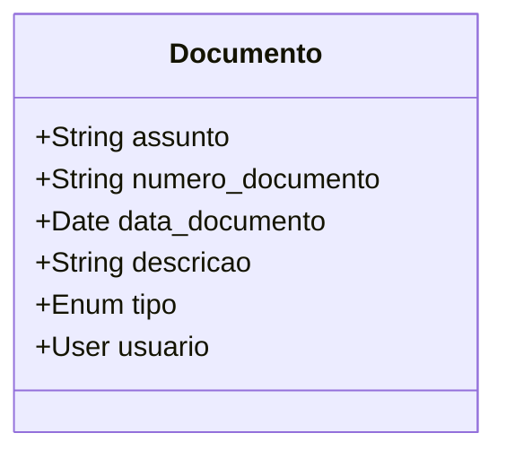
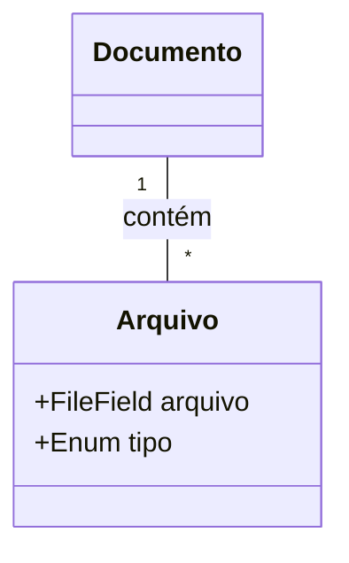
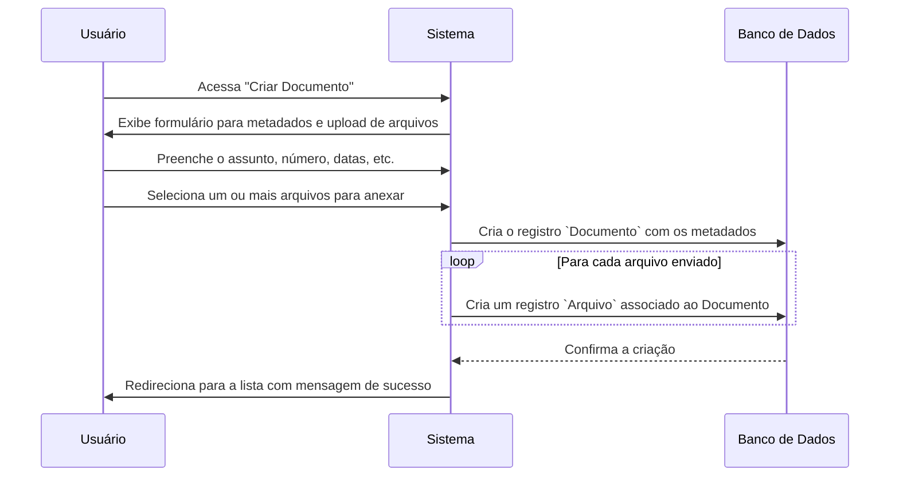

# 🧾 App: Documentos (Gestão de Documentos e Arquivos)

O app `documentos` é o Sistema de Gerenciamento de Documentos (DMS) do SisCoE. Ele é projetado para orquestrar o upload, armazenamento, categorização e visualização de arquivos e documentos oficiais, como boletins, ordens de serviço, relatórios e mídias.

---

## 📋 Visão Geral

O propósito do app é criar um repositório central e organizado para todos os documentos institucionais, facilitando o acesso, a busca e a distribuição de informações. Ele substitui a necessidade de pastas de rede compartilhadas por um sistema com metadados, controle de acesso e visualização integrada.

- 🎯 **Repositório Central**: Armazena documentos e seus anexos de forma estruturada.
- 📂 **Estrutura Flexível**: Permite que um "documento" conceitual (ex: um boletim) contenha múltiplos arquivos (ex: o PDF principal e imagens anexas).
- 🔍 **Busca e Filtragem**: Oferece múltiplas interfaces (lista e galeria) com filtros por data, assunto e tipo para facilitar a localização de documentos.
- 🖼️ **Visualização Integrada**: Permite visualizar certos tipos de arquivos, como PDFs e imagens, diretamente no navegador.

---

## 🗂️ Modelos de Dados

A arquitetura separa os metadados dos arquivos físicos, permitindo uma organização mais rica.

### Documento
Atua como um contêiner ou uma "pasta" para os arquivos. Ele armazena os metadados que descrevem o conjunto.

```python
class Documento(models.Model):
    data_publicacao = models.DateField()
    data_documento = models.DateField()
    numero_documento = models.CharField(max_length=100)
    assunto = models.CharField(max_length=200)
    descricao = models.TextField()
    assinada_por = models.CharField(max_length=100)
    tipo = models.CharField(max_length=10, choices=TIPO_CHOICES, default='OUTRO')
    usuario = models.ForeignKey(settings.AUTH_USER_MODEL, on_delete=models.SET_NULL, null=True)
```



### Arquivo
Representa um arquivo físico individual (.pdf, .jpg, .mp4) associado a um `Documento`.

```python
class Arquivo(models.Model):
    documento = models.ForeignKey(Documento, related_name='arquivos', on_delete=models.CASCADE)
    arquivo = models.FileField(upload_to='documentos/')
    tipo = models.CharField(max_length=10, choices=TIPO_CHOICES)
```



---

## 🔄 Fluxo de Trabalho

O fluxo principal é a criação de um novo registro de documento com seus anexos.



---

## 🎯 Funcionalidades Principais

- **Criação com Múltiplos Anexos**: O formulário `criar_documento` permite o upload de vários arquivos de uma só vez, associando todos a um único registro de documento.
- **Listagem com Filtros**: A view `listar_documentos` exibe uma tabela de todos os documentos, com filtros por intervalo de datas e tipo.
- **Galeria Visual**: A view `galeria_documentos` oferece uma interface alternativa, mostrando os documentos como "cards" e permitindo uma visualização rápida dos anexos de imagem.
- **Gerenciamento de Arquivos (AJAX)**: Na página de detalhes de um documento, é possível adicionar novos arquivos ou excluir anexos existentes de forma assíncrona, sem recarregar a página.
- **Renderização de Markdown**: O campo `descricao` do modelo `Documento` suporta a sintaxe Markdown, que é convertida para HTML na página de detalhes, permitindo formatação rica.

---

## 🔗 Relacionamentos

- **`accounts`**: O modelo `Documento` possui uma `ForeignKey` para o `User` do app `accounts`, registrando quem foi o responsável pela criação do documento no sistema.

---

## 🛡️ Controles de Acesso e Validações

| View | Permissão Requerida | Acesso |
| :--- | :--- | :--- |
| `listar_documentos` / `galeria_documentos` | Autenticação | Todos os usuários logados |
| `criar_documento` | `documentos.add_documento` | Gestores e Admin |
| `editar_documento` | `documentos.change_documento` | Gestores e Admin |
| `excluir_documento` | `documentos.delete_documento` | Gestores e Admin |

- **✅ Validação de Formulário**: O app utiliza `DocumentoForm` para validar os metadados inseridos, garantindo que campos obrigatórios como `assunto` e `data_documento` sejam preenchidos corretamente.
- **✅ Permissões de Arquivo**: A exclusão de um anexo (`excluir_arquivo`) verifica se o usuário possui a permissão `documentos.delete_arquivo` antes de realizar a operação.

---

## 📈 Métricas e Estatísticas

- **Contagem de Documentos**: O sistema permite a contagem de documentos por tipo ou por período, o que pode ser usado para gerar relatórios sobre a produção documental.
- **`Documento.anexos_info`**: Uma `@property` no modelo que retorna um resumo rápido da quantidade e dos tipos de arquivos anexados a um documento (ex: "3 anexos (PDF, Imagem)").

---

## 🎨 Interface do Usuário

- **`listar_documentos.html`**: Template principal que renderiza a tabela de documentos com filtros.
- **`detalhe_documento.html`**: Exibe todos os metadados de um documento, a descrição formatada e a lista de arquivos anexos para download ou visualização.
- **`criar_documento.html`**: Contém o formulário de criação, incluindo os campos para metadados e os inputs para upload de múltiplos arquivos.
- **`galeria_documentos.html`**: Apresenta uma visão em formato de galeria, ideal para documentos que contêm muitas imagens.

---

## 🔧 Configuração Técnica

**URLs Principais**
```python
app_name = 'documentos'

urlpatterns = [
    path('', views.listar_documentos, name='listar_documentos'),
    path('documento/<int:pk>/', views.detalhe_documento, name='detalhe_documento'),
    path('documento/criar/', views.criar_documento, name='criar_documento'),
    path('documento/<int:pk>/editar/', views.editar_documento, name='editar_documento'),
    path('galeria/', views.galeria_documentos, name='galeria_documentos'),
]
```

**Dependências**
- `markdown`: Biblioteca Python utilizada na view `detalhe_documento` para converter a descrição do documento de Markdown para HTML.

---

## 💡 Casos de Uso

**Cenário Típico**: Um oficial de comunicação precisa publicar um novo boletim interno. Ele acessa a função "Criar Documento", preenche o assunto como "Boletim Interno Semanal", informa o número e a data. No campo de descrição, ele escreve um resumo usando formatação Markdown. Em seguida, anexa o arquivo PDF principal do boletim e duas imagens JPG relacionadas. Após salvar, o boletim aparece na lista principal e na página inicial do SisCoE para que todo o efetivo possa visualizar e baixar os arquivos.

**Benefícios**:
- **🎯 Centralização da Informação**: Cria uma fonte única e oficial para todos os documentos, evitando versões desatualizadas em e-mails ou pastas de rede.
- **⚙️ Organização**: A separação entre metadados e arquivos permite buscas e filtros muito mais eficientes.
- **📊 Rastreabilidade**: O vínculo com o usuário que criou o documento permite saber a origem de cada publicação.
- **📈 Acessibilidade**: Facilita o acesso à informação por todo o efetivo, de forma organizada e categorizada.