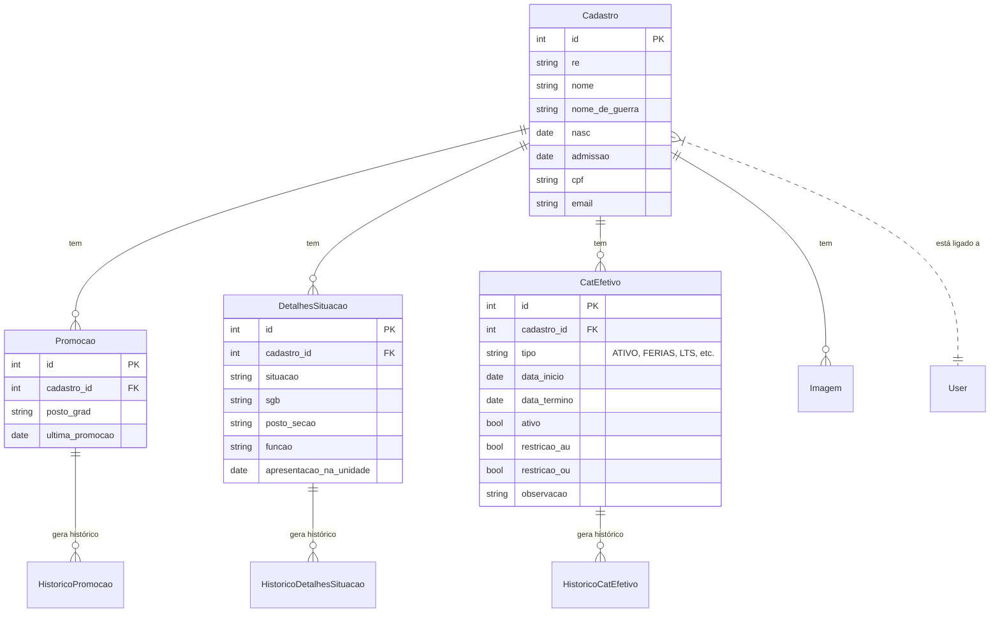

# App: Efetivo

O app `efetivo` é o módulo central do SisCoE, funcionando como o Sistema de Registros (System of Record) para todas as informações pessoais e funcionais dos militares. Ele gerencia desde o cadastro inicial até o histórico completo de promoções, movimentações e status operacional de cada indivíduo.

---

## Modelo de Dados

A arquitetura de dados do `efetivo` é projetada para ser robusta e auditável. Em vez de simplesmente atualizar registros, o sistema frequentemente cria novos registros de estado e move os antigos para tabelas de histórico, preservando uma trilha completa de mudanças.

### `Cadastro`
Este é o modelo principal, a "ficha" do militar. Contém dados pessoais e funcionais que raramente mudam.

!!! abstract "Modelo `efetivo.models.Cadastro`"
    ::: backend.efetivo.models.Cadastro
        options:
          show_root_heading: false
          show_source: false

### `Promocao` e `HistoricoPromocao`
O modelo `Promocao` armazena o posto ou graduação **atual** do militar. Toda vez que uma promoção é editada, um registro é criado em `HistoricoPromocao` para manter o histórico.

!!! abstract "Modelo `efetivo.models.Promocao`"
    ::: backend.efetivo.models.Promocao
        options:
          show_root_heading: false
          show_source: false

### `DetalhesSituacao` e `HistoricoDetalhesSituacao`
Similar à promoção, `DetalhesSituacao` armazena a situação funcional **atual** do militar (onde ele está, qual sua função, etc.). Alterações nesta situação são registradas em `HistoricoDetalhesSituacao`.

!!! abstract "Modelo `efetivo.models.DetalhesSituacao`"
    ::: backend.efetivo.models.DetalhesSituacao
        options:
          show_root_heading: false
          show_source: false

### `CatEfetivo` e `HistoricoCatEfetivo`
Este é um dos modelos mais complexos. Ele gerencia o **status operacional** do militar. Um militar pode ter várias categorias ao longo do tempo (Férias, Licença, etc.), mas geralmente apenas uma está ativa.

-   **Tipos**: O campo `tipo` pode ser `ATIVO`, `FERIAS`, `LTS` (Licença para Tratamento de Saúde), `LSV` (Licença para Serviço Voluntário), `RESTRICAO`, etc.
-   **Restrições Médicas**: Se o `tipo` for `RESTRICAO`, o modelo possui dezenas de campos booleanos (`restricao_au`, `restricao_ou`, etc.) para detalhar exatamente quais atividades o militar não pode realizar.

!!! abstract "Modelo `efetivo.models.CatEfetivo`"
    ::: backend.efetivo.models.CatEfetivo
        options:
          show_root_heading: false
          show_source: false

---

## Principais Fluxos de Trabalho

### Visualização de um Militar (`ver_militar`)
A view `ver_militar` é a página de perfil de um militar. Ela é altamente otimizada para agregar e exibir informações de todos os modelos relacionados em uma única tela, incluindo:
- Dados pessoais do `Cadastro`.
- Posto/Graduação atual da `Promocao`.
- Situação funcional atual de `DetalhesSituacao`.
- Status operacional (férias, licença, etc.) de `CatEfetivo`.
- Lista de cursos e medalhas (dos apps `cursos` e `adicional`).
- Histórico de Licenças Prêmio (do app `lp`).

### Edição e Histórico
Quando um gestor edita a situação funcional ou a promoção de um militar através das views `editar_situacao_funcional` ou `editar_posto_graduacao`, o sistema:
1.  Cria uma cópia do registro atual e a salva na tabela de histórico (`HistoricoDetalhesSituacao` ou `HistoricoPromocao`).
2.  Atualiza o registro principal (`DetalhesSituacao` ou `Promocao`) com as novas informações.

Isso garante que nenhuma informação seja perdida e que todo o histórico de carreira do militar seja rastreável.

---

## Endpoints (URLs) Principais

| URL | View | Nome da URL | Descrição |
| --- | --- | --- | --- |
| `/cadastrar_militar/` | `cadastrar_militar` | `cadastrar_militar` | Exibe o formulário para criar um novo militar. |
| `/listar_militar/` | `listar_militar` | `listar_militar` | Lista todos os militares com status "Efetivo". |
| `/ver_militar/<int:id>/` | `ver_militar` | `ver_militar` | Exibe a página de perfil detalhada de um militar. |
| `/excluir_militar/<int:id>/` | `excluir_militar` | `excluir_militar` | Exclui o registro de um militar. |
| `/editar_posto_graduacao/<int:id>/` | `editar_posto_graduacao` | `editar_posto_graduacao` | Edita a promoção de um militar e cria um registro de histórico. |
| `/editar_situacao_funcional/<int:id>/` | `editar_situacao_funcional` | `editar_situacao_funcional` | Edita a situação funcional e cria um registro de histórico. |
| `/militar/<int:id>/adicionar-categoria/` | `adicionar_categoria_efetivo` | `adicionar_categoria_efetivo` | Adiciona um novo status operacional (férias, licença, etc.). |
| `/militar/<int:id>/historico-categorias/` | `historico_categorias` | `historico_categorias` | Exibe o histórico de todas as categorias de um militar. |
| `/historico_movimentacoes/<int:id>/` | `historico_movimentacoes` | `historico_movimentacoes` | Exibe o histórico de promoções e situações de um militar. |

---

## Sinais e Automações (`signals.py`)

O app `efetivo` utiliza sinais do Django para automatizar certas lógicas de negócio:

-   **`sync_cadastro_to_profiles(sender, instance, ...)`**:
    -   **Gatilho**: `post_save` no modelo `Cadastro`.
    -   **Ação**: Quando um registro de `Cadastro` é salvo (criado ou atualizado), este sinal é disparado para encontrar o `Profile` (do app `core`) associado e sincronizar os dados (como posto/grad, tipo, cpf), garantindo que as informações do perfil do usuário estejam sempre alinhadas com sua ficha no efetivo.

-   **`criar_historico_apos_save(sender, instance, ...)`**:
    -   **Gatilho**: `post_save` no modelo `CatEfetivo`.
    -   **Ação**: Quando uma categoria de efetivo é **atualizada** (não na criação), este sinal chama o método `criar_registro_historico()` para garantir que a alteração seja registrada na tabela de histórico.

-   **`verificar_data_termino(sender, instance, ...)`**:
    -   **Gatilho**: `pre_save` no modelo `CatEfetivo`.
    -   **Ação**: Antes de salvar uma `CatEfetivo`, este sinal verifica se a `data_termino` já passou. Se sim, ele automaticamente muda o `tipo` da categoria para `ATIVO` e anula a data de término, garantindo que afastamentos expirados sejam corretamente revertidos.