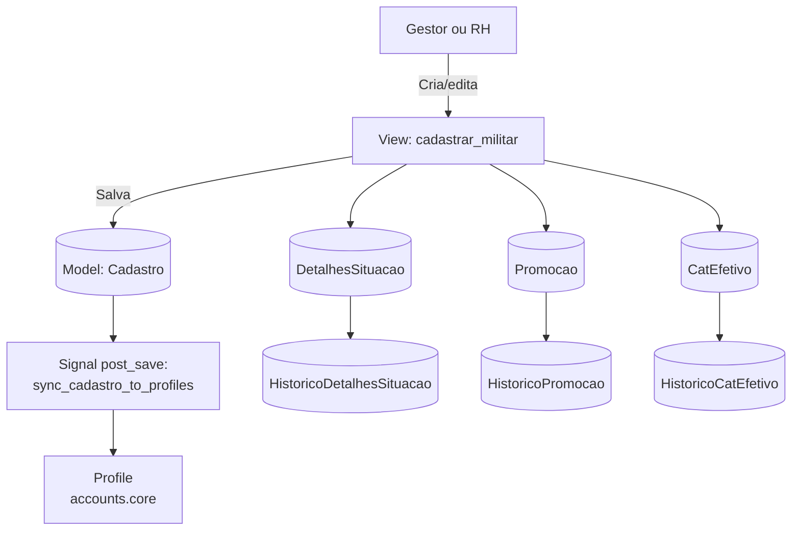
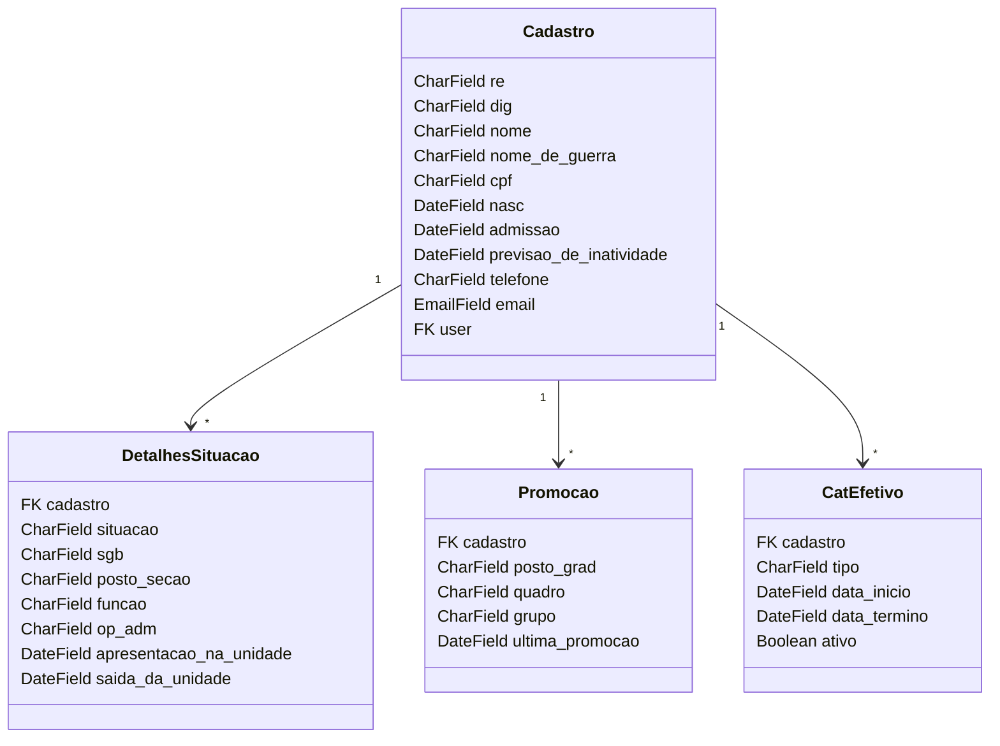
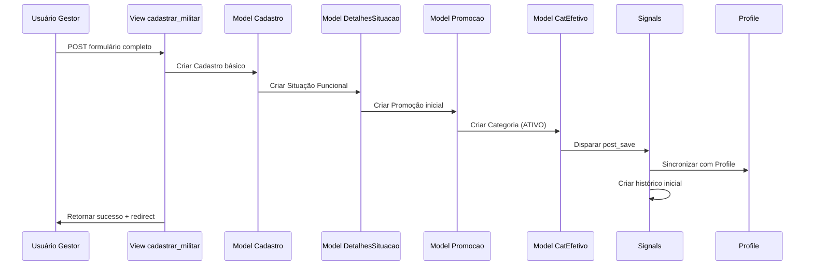
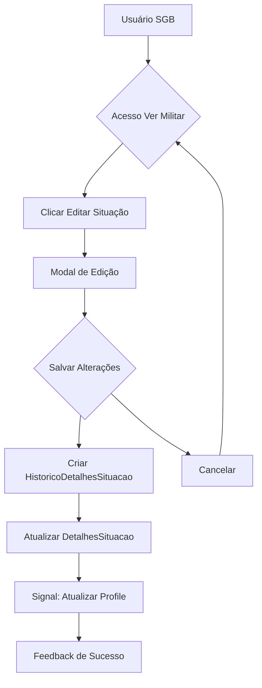
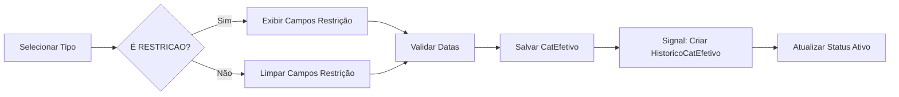
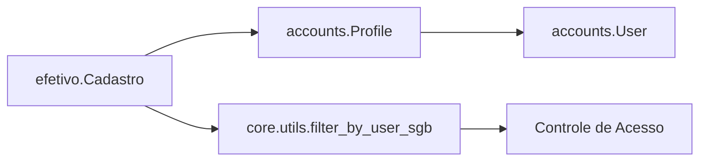

# App: Efetivo — Sistema de Registros de Pessoal

O módulo efetivo é o núcleo do SisCoE — o System of Record responsável por gerenciar o ciclo de vida completo de cada militar, desde o cadastro inicial até o histórico de movimentações, promoções e restrições operacionais.

Ele é a principal fonte de dados do sistema, sendo consultado e atualizado por praticamente todos os demais módulos (accounts, rpt, lp, cursos, adicional, entre outros).

## 📋 Visão Geral

O objetivo principal do app efetivo é manter um cadastro centralizado, rastreável e auditável dos militares, garantindo:

- Integridade de dados via signals e validações;
- Histórico automático de promoções e situações funcionais;
- Rastreabilidade completa por meio de modelos de histórico;
- Integração direta com perfis de usuário (accounts) e relatórios (rpt).

### Público-Alvo:

- Gestores de RH e Comandantes
- Usuários dos Subgrupamentos (SGBs)
- Próprios militares (visualização de perfil público)

### Principais Critérios:

- Transparência total através de histórico automático
- Integridade de dados via validações em cascata
- Segurança por meio de controle granular de permissões

## 🧩 Arquitetura Geral



## 🧬 Modelos de Dados

O módulo efetivo.models define a estrutura central de dados.
Cada alteração relevante (situação funcional, promoção, status de efetivo) gera um snapshot automático em seu respectivo modelo de histórico.

### 🧍‍♂️ Cadastro (Modelo Principal)
**Finalidade:** Armazenar dados pessoais e informações básicas de identificação

**Campos Críticos:**
```python
re = models.CharField(max_length=6, unique=True)  # Registro Efetivo
dig = models.CharField(max_length=1)              # Dígito verificador
cpf = models.CharField(max_length=14, unique=True) # CPF único
nome = models.CharField(max_length=50)            # Nome completo
nome_de_guerra = models.CharField(max_length=20)  # Nome de guerra
email = models.EmailField(unique=True)            # E-mail institucional
```

**Choices Importantes:**
```python
genero_choices = (
    ("Masculino", "Masculino"),
    ("Feminino", "Feminino")
)

alteracao_choices = (
    ("Movimentação", "Movimentação"),
    ("Promoção", "Promoção"),
    # ... 8 tipos de alteração
)
```

**Propriedades Calculadas:**
- `idade_detalhada`: Retorna "X anos, Y meses e Z dias"
- `inativa_status`: Badge colorido com status de inatividade
- `ultima_promocao`: Última promoção via relacionamento
- `tempo_para_inatividade_dias`: Dias restantes para inatividade

### 🏢 DetalhesSituacao
**Finalidade:** Controlar situação funcional e lotação atual

**Campos Principais:**
```python
situacao = models.CharField(choices=situacao_choices)    # Efetivo, Exonerado, etc.
sgb = models.CharField(choices=sgb_choices)              # Subgrupamento
posto_secao = models.CharField(choices=posto_secao_choices) # Lotação
funcao = models.CharField(choices=funcao_choices)        # Função específica
prontidao = models.CharField(choices=prontidao_choices)  # Status operacional
```

**Relacionamentos:**
- `cadastro`: ForeignKey para `Cadastro` (CASCADE)
- `usuario_alteracao`: FK para `User` (SET_NULL)

### 🎖️ Promocao
**Finalidade:** Registrar histórico hierárquico e promoções

**Estrutura de Postos:**
```python
posto_grad_choices = (
    ("Cel PM", "Cel PM"),
    ("Ten Cel PM", "Ten Cel PM"),
    # ... hierarquia completa
    ("Sd PM", "Sd PM")
)
```

**Grupos Organizacionais:**
- Oficiais (Cel, Tc, Maj, Cap, Ten)
- Praças Especiais
- Praças (St/Sgt, Cb/Sd)

### 🩺 CatEfetivo (Categorias de Efetivo)
**Finalidade:** Gerenciar status operacionais e restrições

**Tipos de Categoria:**
```python
TIPO_CHOICES = (
    ("ATIVO", "ATIVO"),
    ("LSV", "LSV"),
    ("LTS", "LTS"),
    ("RESTRICAO", "RESTRIÇÃO"),
    ("FERIAS", "FÉRIAS"),
    # ... 12 categorias totais
)
```

**Sistema de Restrições Médicas:**
- 46 campos booleanos para tipos específicos de restrição
- Mapeamento automático para regras operacionais (5.2.1 a 5.2.9)
- Badges visuais com siglas e descrições

### 📸 Imagem
**Finalidade:** Armazenar e gerenciar fotos de perfil

**Características:**
- Upload para `img/fotos_perfil/`
- Ordenação por data de criação (mais recente primeiro)
- Thumbnails automáticos no admin

### 📚 Modelos de Histórico
**Finalidade:** Auditoria completa de alterações

**Modelos de Histórico:**
- `HistoricoDetalhesSituacao`
- `HistoricoPromocao`
- `HistoricoCatEfetivo`

## 🧬 Diagrama de Classes


## 🔄 Fluxos de Trabalho

### 🎯 Cadastro de Novo Militar


### ✏️ Edição de Situação Funcional


### 🏥 Adição de Categoria de Efetivo


## ⚡ Signals e Automações
```python
 @receiver(post_save, sender=Cadastro)
def sync_cadastro_to_profiles(sender, instance, created, **kwargs):
    """Sincroniza dados de Cadastro com Profiles vinculados."""
    for profile in instance.profiles.all():
        profile.sync_with_cadastro()
        profile.save()

 @receiver(post_save, sender=CatEfetivo)
def criar_historico_apos_save(sender, instance, created, **kwargs):
    """Cria um histórico automático ao atualizar CatEfetivo."""
    if not created:
        instance.criar_registro_historico()

 @receiver(pre_save, sender=CatEfetivo)
def verificar_data_termino(sender, instance, **kwargs):
    """Verifica expiração de categoria e atualiza status automaticamente."""
    if instance.data_termino and instance.data_termino < date.today():
        instance.tipo = "ATIVO"
```

## 📝 Funcionalidades Principais

- **Cadastro Completo**: Processo em lote para criação de militar com validação de CPF, criação de `Cadastro`, `DetalhesSituacao`, `Promocao` e `CatEfetivo` iniciais.
- **Sistema de Busca e Filtros**: Filtros por SGB, grupo hierárquico, posto/seção, status de inatividade e situação funcional, com busca textual por RE, nome, CPF, etc.
- **Visualização em Grade**: Estrutura hierárquica para visualização do efetivo por subgrupamento e seção.
- **Geração de Etiquetas PDF**: Usa `ReportLab` para criar etiquetas de identificação profissionais.
- **Histórico de Movimentações**: Auditoria completa de promoções e mudanças de situação funcional.

## 🎨 Interface e Componentes Visuais

### Templates Principais
| Template | Função | Componentes Destacados |
| :--- | :--- | :--- |
| `ver_militar.html` | Perfil 360° | Badges de status, timeline histórico, modais de edição |
| `listar_militar.html` | Listagem geral | Filtros dinâmicos, tabela responsiva, busca em tempo real |
| `cadastrar_militar.html` | Formulário completo | Abas organizadas, validação client-side, upload de imagem |

### Componentes Visuais
- **Badges de Status**: Verde (Ativo), Amarelo (Alerta), Vermelho (Crítico), Azul (Informativo).
- **Indicadores de Tempo**: Progress bars para tempo de serviço e contadores regressivos para inatividade.
- **Design Responsivo**: Tabelas completas em desktop, condensadas em tablets e cards em mobile.

## 🔗 Relacionamentos com Outros Apps

### Integração com Accounts


**Fluxo de Sincronização:**
1. `Cadastro` criado/atualizado no `efetivo`.
2. Signal dispara sincronização com `Profile`.
3. Dados replicados para `User` associado.
4. Permissões atualizadas conforme SGB.

### Dependências Cruzadas
| Módulo | Tipo | Propósito |
| :--- | :--- | :--- |
| `rpt` | ForeignKey | Controle de transferências |
| `lp` | ForeignKey | Gestão de licenças prêmio |
| `cursos` | ForeignKey | Histórico de capacitação |
| `municipios` | Choice Reference | Estrutura organizacional |

## 🛡️ Controles de Acesso e Validações

- **Sistema de Permissões**: Hierarquia com `@permissao_necessaria` (`gestor`, `sgb`, `militar`).
- **Validações de Negócio**: Unicidade de CPF/RE, temporalidade de datas, consistência entre situação e categoria.
- **Validações Automáticas**: Cálculo de idade, expiração de categorias, sincronização com perfis.

## 🌐 URLs (urls.py)
```python
urlpatterns = [
    path('cadastrar_militar/', views.cadastrar_militar, name="cadastrar_militar"),
    path('listar_militar/', views.listar_militar, name="listar_militar"),
    path('ver_militar/<int:id>/', views.ver_militar, name="ver_militar"),
    path('historico_movimentacoes/<int:id>/', views.historico_movimentacoes, name='historico_movimentacoes'),
]
```

## 🚀 Extensões Futuras

- 🔌 API RESTful (Django REST Framework);
- 📊 Dashboard analítico de efetivo;
- 🔄 Sincronização automática com `accounts` e `rpt`;
- 🧠 Módulo de previsão de inatividade com IA interna.

## 🧩 Stack Técnica
| Componente | Tecnologia |
| :--- | :--- | :--- |
| Framework | Django 5.x |
| ORM | Django ORM |
| Banco de Dados | PostgreSQL |
| Auth | Custom User (accounts.User) |
| UI | TailwindCSS + Django Templates |
| PDF | ReportLab |
| Imagem | Pillow |
| Teste | Faker |
| Diagrama | Mermaid (Material MkDocs) |

---

* **📘 Autor**: Equipe de Desenvolvimento SisCoE
* **🧑‍💻 Última Atualização**: Outubro 2025
* **🧭 Responsável Técnico**: Módulo Efetivo — Base Central do Sistema
* **🔗 Dependências**: `accounts`, `core`, `rpt`, `lp`, `cursos`, `municipios`

## 🧰 Exemplos de Uso de Signals

A arquitetura de histórico baseada em `signals` é um padrão reutilizável em todo o sistema. Se um novo módulo precisar de uma trilha de auditoria, o mesmo padrão pode ser aplicado.

**Exemplo: Criando um Histórico para o App `cursos`**

Suponha que desejamos auditar cada alteração no modelo `Curso`.

1.  **Criar o modelo de histórico:**
    No `cursos/models.py`, criaríamos um `HistoricoCurso` que espelha os campos de `Curso`.

    ```python
    # cursos/models.py

    class HistoricoCurso(models.Model):
        curso_original = models.ForeignKey(Curso, on_delete=models.SET_NULL, null=True)
        usuario_alteracao = models.ForeignKey(settings.AUTH_USER_MODEL, on_delete=models.SET_NULL, null=True)
        data_alteracao = models.DateTimeField(auto_now_add=True)
        
        # Campos espelhados de Curso
        curso = models.CharField(max_length=255)
        data_publicacao = models.DateField()
        bol_publicacao = models.CharField(max_length=255)
        # ...e assim por diante.
    ```

2.  **Criar o signal:**
    No `cursos/signals.py`, criaríamos um receiver para o `post_save`.

    ```python
    # cursos/signals.py

    from django.db.models.signals import post_save
    from django.dispatch import receiver
    from .models import Curso, HistoricoCurso

    @receiver(post_save, sender=Curso)
    def criar_historico_curso(sender, instance, created, **kwargs):
        """
        Cria um registro de histórico sempre que um Curso é alterado.
        """
        if not created: # Executa apenas em atualizações
            HistoricoCurso.objects.create(
                curso_original=instance,
                usuario_alteracao=instance.usuario_alteracao, # Supondo que o modelo Curso tenha este campo
                curso=instance.curso,
                data_publicacao=instance.data_publicacao,
                bol_publicacao=instance.bol_publicacao
            )
    ```
Este padrão garante que a lógica de auditoria seja desacoplada dos `views`, tornando o sistema mais robusto e fácil de manter.