# App: LP (Licença Prêmio)

O app `lp` é um módulo completo e robusto para gerenciar todo o ciclo de vida da **Licença Prêmio (LP)** dos militares. O processo é inteligentemente dividido em duas fases principais: a **Aquisição do Direito** e a **Fruição do Direito**.

---

## Fase 1: Aquisição do Direito

Esta fase consiste em acompanhar o período de 5 anos (período aquisitivo) que um militar deve cumprir para ter direito a 90 dias de licença.

### Modelo `LP`
O modelo `LP` é o coração desta fase. Cada registro representa um bloco de 5 anos na carreira do militar.

!!! abstract "Modelo `lp.models.LP`"
    ::: backend.lp.models.LP
        options:
          show_root_heading: false
          show_source: false

### Workflow de Aquisição
O status de um bloco de LP (`status_lp`) progride através do seguinte workflow:

```mermaid
stateDiagram-v2
    direction LR
    [*] --> Aguardando_Requisitos: Início do período
    Aguardando_Requisitos --> Apta_para_Concessao: 5 anos cumpridos
    Apta_para_Concessao --> Lancado_no_SIPA: Gestor registra
    Lancado_no_SIPA --> Concedido: Processamento
    Concedido --> Publicado: Publicação em Boletim
    Publicado --> Concluido: Ciclo finalizado
```

1.  **Aguardando Requisitos**: O período de 5 anos está em andamento.
2.  **Apta para Concessão**: O período de 5 anos foi cumprido. A LP está pronta para ser concedida.
3.  **Lançado no SIPA**: Um gestor confirma que a LP foi lançada no Sistema Integrado de Pagamentos.
4.  **Concedido**: A LP foi oficialmente concedida.
5.  **Publicado**: Os dados da publicação em Boletim Geral (BOL G PM) são registrados.
6.  **Concluído**: O ciclo de aquisição termina. Neste ponto, o sistema automaticamente inicia a Fase 2.

---

## Fase 2: Fruição do Direito

Uma vez que um bloco de `LP` é marcado como `Concluído`, o militar passa a ter um saldo de 90 dias para usufruir. Esta fase gerencia o uso desse saldo.

### O `Signal` de Transição
A transição entre as fases é automatizada pelo `signal` `criar_fruicao_ao_concluir_lp`. Quando uma `LP` é salva com o status `Concluído`, este sinal cria automaticamente um registro no modelo `LP_fruicao`, creditando o saldo inicial de 90 dias.

### Modelo `LP_fruicao`
Este modelo representa o "saldo" da Licença Prêmio que o militar pode usar.

-   **Controle de Saldo**: Gerencia os campos `dias_disponiveis` e `dias_utilizados`.
-   **Registro de Afastamentos**: Permite registrar os períodos de afastamento (fruição de 15, 30, 45, 60, 75 ou 90 dias) ou a conversão em pecúnia. Cada afastamento registrado debita o valor correspondente do saldo.

!!! abstract "Modelo `lp.models.LP_fruicao`"
    ::: backend.lp.models.LP_fruicao
        options:
          show_root_heading: false
          show_source: false

---

## Auditoria e Histórico

Para garantir a máxima rastreabilidade, cada alteração significativa gera um registro de histórico:
-   **`HistoricoLP`**: Salva um snapshot de cada alteração feita em um registro `LP`.
-   **`HistoricoFruicaoLP`**: Salva um snapshot de cada alteração feita em um registro `LP_fruicao`, registrando cada período de afastamento.

---

## Endpoints (URLs) Principais

| URL | View | Fase | Descrição |
| --- | --- | --- | --- |
| `/cadastrar/` | `cadastrar_lp` | Aquisição | Inicia o cadastro de um novo bloco de LP para um militar. |
| `/lista/` | `listar_lp` | Aquisição | Lista todas as LPs em andamento. |
| `/<int:pk>/` | `ver_lp` | Ambas | Exibe a página de detalhes completa de uma LP, incluindo sua fruição. |
| `/<int:pk>/concluir/` | `concluir_lp` | Aquisição | Conclui o ciclo de aquisição e dispara a criação da fruição. |
| `/fruicao/<int:pk>/` | `detalhar_fruicao` | Fruição | Exibe os detalhes do saldo e uso de uma LP. |
| `/fruicao/<int:pk>/adicionar-afastamento/` | `adicionar_afastamento` | Fruição | Adiciona um novo período de afastamento, debitando do saldo. |