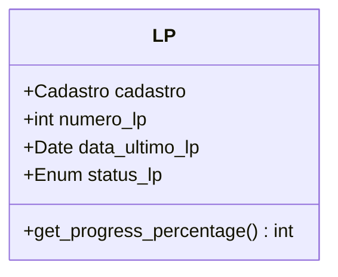
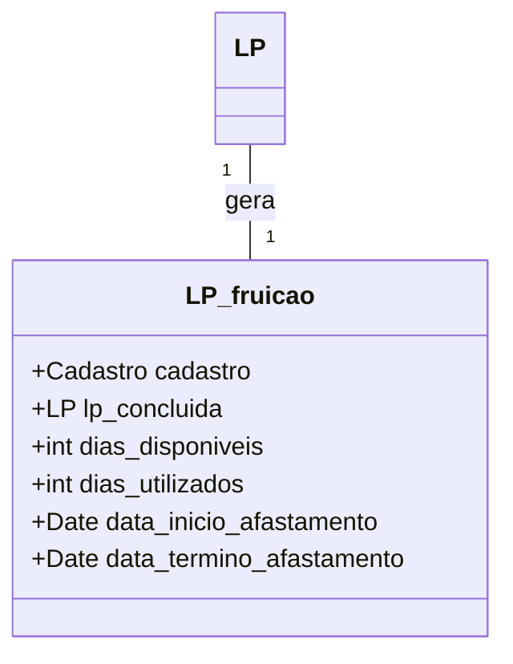
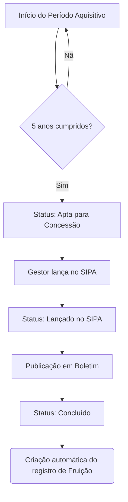
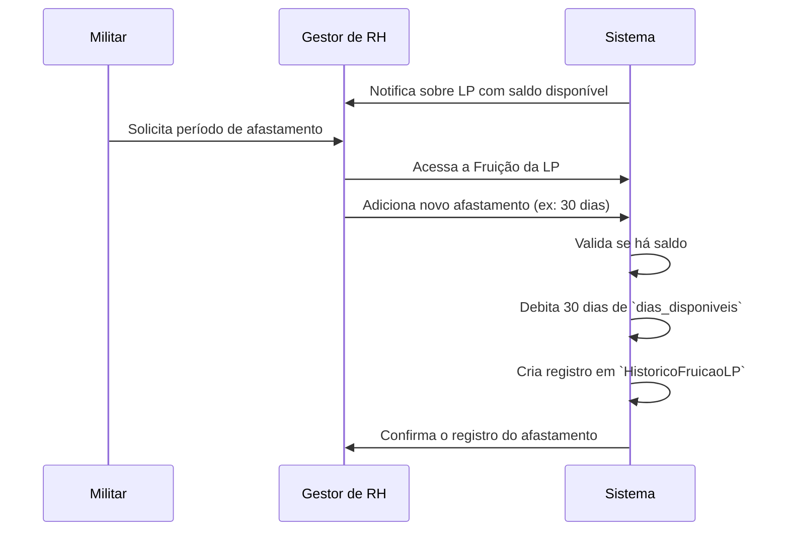

# 🧾 App: LP (Gestão de Licença Prêmio)

O app `lp` gerencia todo o ciclo de vida da Licença Prêmio (LP) dos militares, desde o cumprimento dos requisitos para adquiri-la até o controle do seu usufruto (fruição).

---

## 📋 Visão Geral

O módulo automatiza e torna transparente o processo de concessão e fruição de LPs, um benefício de carreira crucial. Ele atende diretamente ao setor de RH (B/1) e aos próprios militares, que podem acompanhar o progresso de suas licenças.

- 🎯 **Gestão do Ciclo de Vida**: Controla a LP desde a aquisição do direito até a fruição completa do saldo de 90 dias.
- 📊 **Separação de Fases**: O processo é dividido em duas fases lógicas: **Aquisição** (5 anos de serviço) e **Fruição** (uso dos 90 dias).
- 🔄 **Automação**: A transição da fase de aquisição para a de fruição é automática, baseada na conclusão do ciclo de 5 anos.
- 🧠 **Controle de Saldo**: Gerencia de forma precisa os dias de LP utilizados e os dias ainda disponíveis para cada militar.
- 📈 **Auditoria Completa**: Mantém um histórico detalhado de todas as alterações, garantindo máxima rastreabilidade.

---

## 🗂️ Modelos de Dados

A arquitetura é composta por quatro modelos principais, dois para cada fase do processo.

### Fase 1: Aquisição

**LP**: Representa um bloco de 5 anos de serviço (período aquisitivo) para uma LP.
```python
class LP(models.Model):
    class StatusLP(models.TextChoices):
        AGUARDANDO_REQUISITOS = 'aguardando_requisitos', 'Aguardando Requisitos'
        APTA_CONCESSAO = 'apta_concessao', 'Apta para Concessão'
        LANCADO_SIPA = 'lancado_sipa', 'Lançado no SIPA'
        CONCEDIDO = 'concedido', 'Concedido'
        PUBLICADO = 'publicado', 'Publicado'
        CONCLUIDO = 'concluido', 'Concluído'

    cadastro = models.ForeignKey('efetivo.Cadastro', on_delete=models.CASCADE)
    numero_lp = models.PositiveSmallIntegerField(choices=N_CHOICES)
    data_ultimo_lp = models.DateField(null=True, blank=True)
    status_lp = models.CharField(max_length=30, choices=StatusLP.choices, default=StatusLP.AGUARDANDO_REQUISITOS)
    # ... outros campos de controle e datas
```



**HistoricoLP**: Registra cada alteração feita em um objeto `LP`.

### Fase 2: Fruição

**LP_fruicao**: Controla o saldo de 90 dias de uma LP que já foi concedida.
```python
class LP_fruicao(models.Model):
    cadastro = models.ForeignKey('efetivo.Cadastro', on_delete=models.CASCADE)
    lp_concluida = models.OneToOneField(LP, on_delete=models.CASCADE)
    dias_disponiveis = models.PositiveSmallIntegerField(default=90)
    dias_utilizados = models.PositiveSmallIntegerField(default=0)
    data_inicio_afastamento = models.DateField(null=True, blank=True)
    data_termino_afastamento = models.DateField(null=True, blank=True)
    # ... outros campos de controle
```



**HistoricoFruicaoLP**: Registra cada período de afastamento ou alteração no saldo de uma `LP_fruicao`.

---

## 🔄 Fluxo de Trabalho

O fluxo é linear e progressivo, passando da aquisição para a fruição.

**Fluxo de Aquisição (Fase 1)**


**Fluxo de Fruição (Fase 2)**


---

## 🎯 Funcionalidades Principais

- **Visualização de Dados**: Tela de detalhes unificada que mostra o progresso da aquisição e o saldo da fruição, com todo o histórico de alterações.
- **Criação e Edição**: Cadastro de novos períodos aquisitivos de LP e registro dos períodos de afastamento.
- **Barra de Progresso**: Um indicador visual mostra em que etapa do fluxo de aquisição a LP se encontra.
- **Cálculos Automáticos**: O sistema calcula automaticamente a data final do período aquisitivo e o saldo de dias disponíveis para fruição.
- **Auditoria**: Cada alteração nos modelos `LP` e `LP_fruicao` é registrada nos seus respectivos modelos de histórico.

---

## 🔗 Relacionamentos

- **`efetivo` (Essencial)**: O app `lp` é totalmente dependente do `efetivo.Cadastro`. Cada registro de LP ou fruição está diretamente ligado a um militar específico.
  ```python
  # No modelo LP e LP_fruicao
  cadastro = models.ForeignKey('efetivo.Cadastro', on_delete=models.CASCADE)
  ```

---

## 🛡️ Controles de Acesso e Validações

| View | Permissão Requerida | Acesso |
| :--- | :--- | :--- |
| `listar_lp` | Autenticação | Todos os usuários logados |
| `cadastrar_lp` | `lp.add_lp` | Gestores de RH / Admin |
| `adicionar_afastamento` | `lp.change_lp_fruicao` | Gestores de RH / Admin |

- **✅ Duplicidade**: Um militar não pode ter o mesmo `numero_lp` cadastrado duas vezes (`unique_together`).
- **✅ Integridade de Datas**: O sistema valida para que datas de publicação ou concessão não sejam anteriores a datas de eventos prévios.
- **✅ Saldo**: Impede que um militar utilize mais dias de LP do que os 90 dias disponíveis em `dias_disponiveis`.

---

## 📈 Métricas e Estatísticas

- **`LP.get_progress_percentage()`**: `@property` que calcula a porcentagem de progresso no fluxo de aquisição, usada para alimentar a barra de progresso visual.
- **`LP_fruicao.dias_utilizados_percent()`**: `@property` que calcula o percentual de dias de LP já utilizados pelo militar.

---

## 🎨 Interface do Usuário

- **`listar_lp.html`**: Tabela com todas as LPs, mostrando o militar, o número da LP e a barra de progresso do status de aquisição.
- **`ver_lp.html`**: Página de detalhes completa com duas seções claras: "Aquisição" (com a linha do tempo do status) e "Fruição" (com o saldo e o histórico de afastamentos).
- **`adicionar_afastamento.html`**: Formulário para registrar um novo período de fruição (15, 30, ..., 90 dias) ou a conversão em pecúnia.

---

## 🔧 Configuração Técnica

**URLs Principais**
```python
app_name = 'lp'

urlpatterns = [
    path('cadastrar/', views.cadastrar_lp, name='cadastrar_lp'),
    path('lista/', views.listar_lp, name='listar_lp'),
    path('<int:pk>/', views.ver_lp, name='ver_lp'),
    path('fruicao/<int:pk>/adicionar-afastamento/', views.adicionar_afastamento, name='adicionar_afastamento'),
]
```

**Dependências**: Nenhuma dependência externa crítica além do próprio Django e do app `efetivo`.

---

## 💡 Casos de Uso

**Cenário Típico**: Um gestor de RH cadastra o 3º bloco de Licença Prêmio para um militar. O sistema inicia o acompanhamento do período de 5 anos. Após o término, o status da LP muda para "Apta para Concessão". O gestor preenche os dados de publicação e conclui a fase de aquisição. Automaticamente, o sistema cria um registro de fruição com 90 dias de saldo. Meses depois, o militar solicita 30 dias de afastamento. O gestor acessa a tela de fruição, registra o afastamento, e o sistema atualiza o saldo para 60 dias disponíveis, mantendo todo o histórico registrado.

**Benefícios**:
- **🎯 Transparência**: O militar e o gestor sabem exatamente em que estágio a LP se encontra.
- **⚙️ Automação**: Elimina o controle manual de planilhas para acompanhar períodos e saldos.
- **📊 Controle**: Garante que as regras de concessão e fruição sejam seguidas corretamente.
- **📈 Rastreabilidade**: Todo o ciclo de vida da LP é auditável.