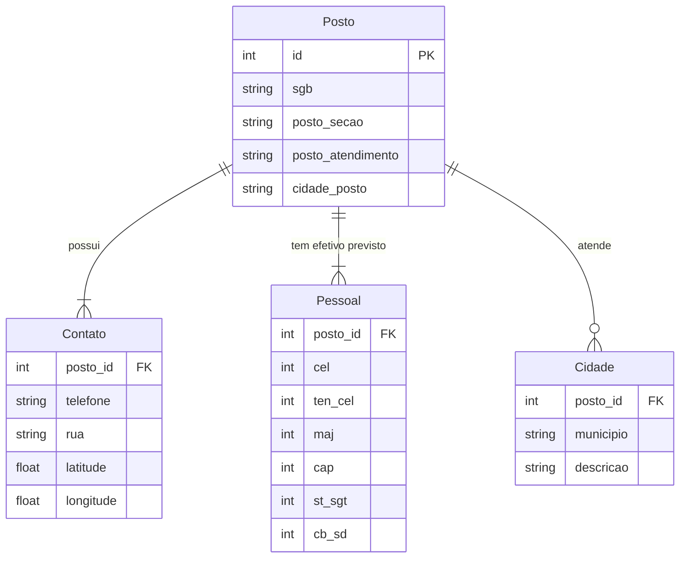

# App: Municipios

O app `municipios` é um módulo de **Gestão de Postos de Bombeiros e suas Áreas de Atuação**. Ele vai além de um simples cadastro de cidades, funcionando como um sistema de inteligência organizacional e geográfica que mapeia a estrutura do grupamento.

A principal função do app é permitir a análise de **efetivo previsto vs. efetivo real** para cada unidade, além de fornecer ferramentas logísticas.

---

## Modelo de Dados

A arquitetura de dados é centrada no conceito de `Posto`, com modelos relacionados que detalham suas características.

-   **`Posto`**: O modelo central. Representa uma unidade física de bombeiros (ex: "EB CERRADO").
-   **`Contato`**: Armazena o endereço, telefone e, crucialmente, as coordenadas de **latitude e longitude** de cada posto.
-   **`Pessoal`**: Define o **efetivo previsto (QPO)** para cada posto, detalhando a quantidade de vagas por patente.
-   **`Cidade`**: Mapeia quais municípios são atendidos por cada posto, permitindo uma relação de um-para-muitos (um posto pode cobrir várias cidades).

!!! abstract "Modelo `municipios.models.Posto`"
    ::: backend.municipios.models.Posto
        options:
          show_root_heading: false
          show_source: false

!!! abstract "Modelo `municipios.models.Pessoal`"
    ::: backend.municipios.models.Pessoal
        options:
          show_root_heading: false
          show_source: false

---

## Funcionalidades Principais

### Análise de Efetivo (Previsto vs. Real)
A funcionalidade mais importante do app é a capacidade de comparar o efetivo planejado com o efetivo real. A view `posto_detail` realiza a seguinte operação:
1.  Obtém o efetivo **previsto** para um posto a partir do modelo `Pessoal`.
2.  Consulta o app `efetivo` para contar quantos militares (`efetivo.DetalhesSituacao`) estão atualmente lotados naquele mesmo posto (`posto_secao`).
3.  Apresenta uma comparação lado a lado, permitindo que os gestores identifiquem rapidamente o **"claro"** (vagas não preenchidas) ou o **"excedente"** de pessoal em cada unidade.

### Calculadora de Rota
Utilizando os dados de latitude e longitude do modelo `Contato`, a view `calcular_rota` oferece uma ferramenta logística que:
-   Permite ao usuário selecionar um posto de origem e um de destino.
-   Calcula a distância em linha reta entre os dois pontos usando a biblioteca `geopy`.
-   Estima o tempo de viagem com base em uma velocidade média.

### Importação e Exportação
O módulo também inclui utilitários para gerenciar dados em massa, como a importação de dados de municípios a partir de planilhas e a exportação de relatórios em PDF e CSV.

---

## Endpoints (URLs) Principais

| URL | View | Nome da URL | Descrição |
| --- | --- | --- | --- |
| `/` | `posto_list` | `posto_list` | Lista todos os postos de bombeiros cadastrados. |
| `/<int:pk>/` | `posto_detail` | `posto_detail` | Exibe a página de detalhes de um posto, com a análise de efetivo. |
| `/novo/` | `posto_create` | `posto_create` | Formulário para criar um novo posto e seus dados relacionados. |
| `/<int:pk>/editar/` | `posto_update` | `posto_update` | Permite a edição dos dados de um posto. |
| `/calcular_rota/` | `calcular_rota` | `calcular_rota` | Endpoint que processa o cálculo de distância entre dois postos. |
| `/importar/` | `importar_municipios` | `importar_municipios` | Página para upload de arquivos para importação de dados. |