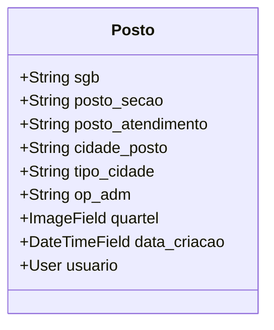
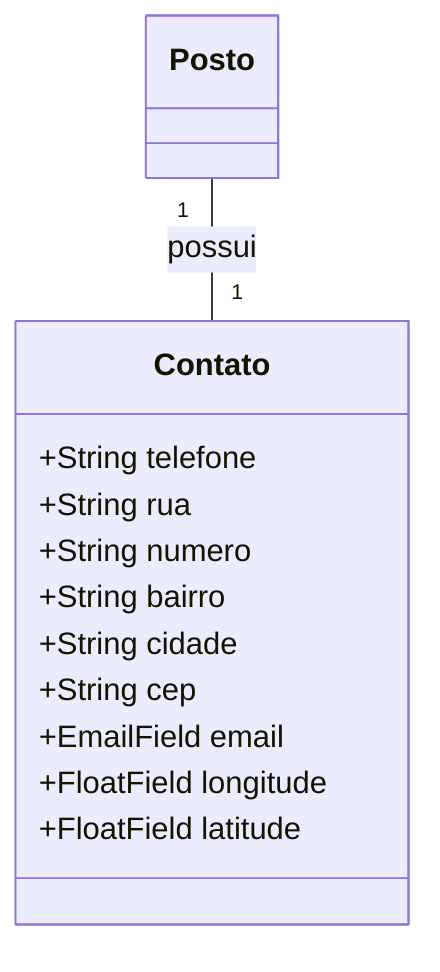
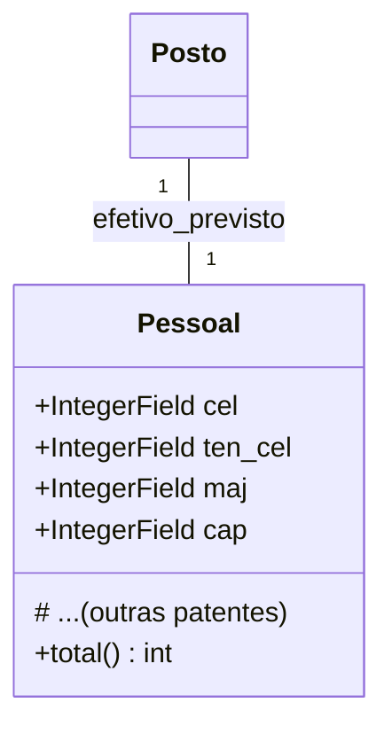
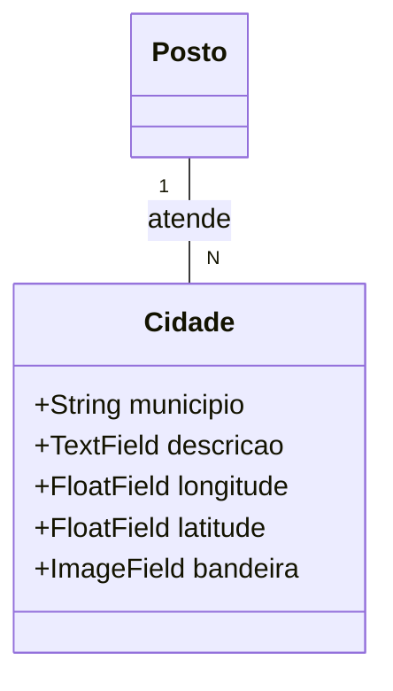
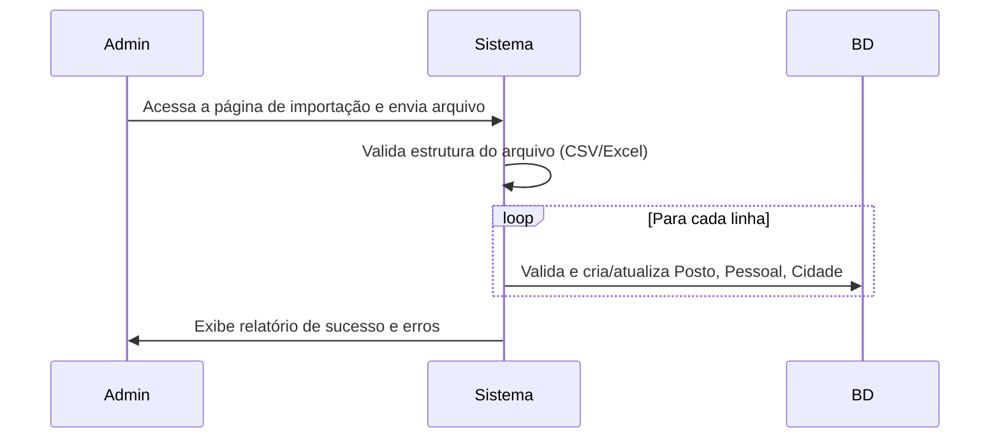

# 🧾 App: Municipios (Gestão de Postos e Áreas de Atuação)

O app `municipios` é um sistema de inteligência organizacional e geográfica para a gestão de Postos de Bombeiros e suas áreas de atuação. Ele mapeia a estrutura do grupamento, permitindo a análise de efetivo previsto vs. real e fornecendo ferramentas logísticas.

---

## 📋 Visão Geral

O `municipios` serve como uma plataforma central para a tomada de decisão estratégica, otimizando a distribuição de recursos humanos e operacionais.

- 🎯 **Análise de Efetivo**: Identifica o "claro" (déficit) e o excedente de pessoal em cada unidade.
- 🗺️ **Gestão Territorial**: Mapeia a cobertura operacional, associando postos a múltiplos municípios.
- 🚗 **Inteligência Logística**: Fornece ferramentas para cálculo de rotas e distâncias entre postos.
- 🔄 **Integração**: Conecta-se a outros módulos, como `efetivo` e `rpt`, para uma visão unificada.
- 📈 **Relatórios e Métricas**: Gera dados consolidados para apoiar o planejamento do comando.

---

## 🗂️ Modelos de Dados

A arquitetura de dados é centrada no modelo `Posto` e suas entidades relacionadas.

### Posto
Representa uma unidade física de bombeiros.

```python
class Posto(models.Model):
    sgb = models.CharField(max_length=30, blank=False, null=False, choices=sgb_choices)
    posto_secao = models.CharField(max_length=120, blank=False, null=False, choices=posto_secao_choices)
    posto_atendimento = models.CharField(max_length=50, blank=False, null=False, choices=posto_atendimento_choices)
    cidade_posto = models.CharField(max_length=50, blank=False, null=False, choices=cidade_posto_choices)
    tipo_cidade = models.CharField(max_length=50, blank=False, null=False, choices=op_adm_choices)
    op_adm = models.CharField(max_length=50, blank=False, null=False, choices=tipo_choices)
    quartel = models.ImageField(upload_to='img/quartel/', blank=True, null=True)
    data_criacao = models.DateTimeField(default=timezone.now)
    usuario = models.ForeignKey(settings.AUTH_USER_MODEL, on_delete=models.CASCADE)
```



### Contato
Armazena dados de localização e contato do `Posto`.

```python
class Contato(models.Model):
    posto = models.OneToOneField(Posto, on_delete=models.CASCADE, related_name='contato')  
    telefone = models.CharField(max_length=20)
    rua = models.CharField(max_length=100)
    numero = models.CharField(max_length=10)
    bairro = models.CharField(max_length=100)
    cidade = models.CharField(max_length=100)
    cep = models.CharField(max_length=9)
    email = models.EmailField()
    longitude = models.FloatField()
    latitude = models.FloatField()
```



### Pessoal
Define o efetivo previsto (QPO) para cada `Posto`.

```python
class Pessoal(models.Model):
    posto = models.ForeignKey(Posto, on_delete=models.CASCADE, related_name='pessoal')
    cel = models.IntegerField()
    ten_cel = models.IntegerField()
    maj = models.IntegerField()
    cap = models.IntegerField()
    tenqo = models.IntegerField()
    tenqa = models.IntegerField()
    asp = models.IntegerField()
    st_sgt = models.IntegerField()
    cb_sd = models.IntegerField()

    @property
    def total(self):
        return (self.ten_cel + self.maj + self.cap + self.tenqo + self.tenqa + self.st_sgt + self.cb_sd)
```



### Cidade
Mapeia os municípios atendidos por um `Posto`.

```python
class Cidade(models.Model):
    posto = models.ForeignKey(Posto, on_delete=models.CASCADE, related_name='cidades')
    descricao = models.TextField(blank=True)
    municipio = models.CharField(max_length=100, choices=municipio_choices)
    longitude = models.FloatField()
    latitude = models.FloatField()
    bandeira = models.ImageField(upload_to='img/bandeiras/%Y/%m/%d/', blank=True, null=True)
```



---

## 🔄 Fluxo de Trabalho

O principal fluxo do app é a análise de efetivo por um gestor.

```mermaid
flowchart TD
    A[Acessar Detalhes do Posto] --> B[Carregar Efetivo Previsto (QPO)]
    B --> C[Consultar Efetivo Real no App 'efetivo']
    C --> D[Calcular Diferença (Claro / Excedente)]
    D --> E[Exibir Tabela Comparativa na Interface]
    E --> F[Apoiar Tomada de Decisão]
```

Um segundo fluxo importante é a importação de dados em lote.



---

## 🎯 Funcionalidades Principais

- **Visualização de Dados**: Detalhes completos de cada posto, incluindo sua equipe prevista, localização no mapa e cidades atendidas.
- **Criação e Edição**: Formulários para gerenciar todos os dados dos postos e seus relacionamentos.
- **Exportação e Relatórios**: Exportação da lista de postos e seu efetivo (previsto vs. real) para formatos PDF e Excel.
- **Importação em Massa**: Ferramenta para administradores para popular ou atualizar dados de múltiplos postos a partir de uma planilha.
- **Auditoria**: O sistema (idealmente) deveria registrar o histórico de alterações nos modelos críticos.

---

## 🔗 Relacionamentos

- **`efetivo` (Essencial)**: O app consome dados do `efetivo.DetalhesSituacao` para obter o "efetivo real" de um posto, filtrando pela `secao_atual`. Esta é a principal integração para a análise comparativa.
  ```python
  from efetivo.models import DetalhesSituacao
  efetivo_real = DetalhesSituacao.objects.filter(secao_atual=posto.posto_secao, ativo=True).count()
  ```
- **`rpt` (Estratégico)**: Os dados sobre vagas (déficit de efetivo) gerados no app `municipios` são a principal fonte de informação para o app `rpt` priorizar e sugerir transferências.

---

## 🛡️ Controles de Acesso e Validações

| View | Permissão Requerida | Acesso |
| :--- | :--- | :--- |
| `posto_list` | Autenticação | Todos os usuários logados |
| `posto_detail` | Autenticação | Todos os usuários logados |
| `posto_create` | `municipios.add_posto` | Gestores e Admin |
| `posto_update` | `municipios.change_posto` | Gestores e Admin |

- **✅ Unicidade**: O campo `posto_secao` no modelo `Posto` é único para evitar duplicidade de unidades.
- **✅ Integridade**: Um `Posto` não pode ser excluído se houver registros relacionados em outros apps (ex: militares ativos lotados nele).

---

## 📈 Métricas e Estatísticas

- **`Pessoal.total`**: `@property` que retorna o total de vagas previstas para um posto.
- **Cálculo de Ocupação**: Lógica na `view` ou em uma classe de serviço que calcula a taxa de ocupação (`real / previsto * 100`).
- **Relatórios Consolidados**: Funções que agregam dados para exibir o total de efetivo previsto, real e o déficit/excedente por Subgrupamento (SGB) ou para o 15º GBM como um todo.

---

## 🎨 Interface do Usuário

- **`posto_list.html`**: Apresenta uma tabela responsiva com todos os postos, com filtros por SGB e cidade.
- **`posto_detail.html`**: Visão completa de um posto, com cards informativos, a tabela de previsto vs. real, e um mapa interativo (`Leaflet.js`) mostrando a localização.
- **Componentes Visuais**:
  - **Badges**: Indicam o status do efetivo (Déficit, Excedente, Completo).
  - **Cards**: Exibem métricas rápidas como total de vagas, efetivo real e o saldo.

---

## 🔧 Configuração Técnica

**URLs Principais**
```python
app_name = 'municipios'

urlpatterns = [
    path('postos/', views.PostoListView.as_view(), name='posto_list'),
    path('postos/<int:pk>/', views.PostoDetailView.as_view(), name='posto_detail'),
    # ... (outras URLs)
]
```

**Dependências**
- `geopy`: Para cálculos de distância geodésica.
- `pandas`, `openpyxl`: Para manipulação de arquivos Excel/CSV na importação/exportação.
- `reportlab`: Para geração de relatórios em PDF.

---

## 💡 Casos de Uso

**Cenário Típico**: Um gestor de RH precisa avaliar a necessidade de pessoal no 2º SGB. Ele acessa a lista de postos, filtra pelo SGB desejado e analisa o detalhe de cada posto. Ele identifica que o "Posto de Itu" tem um déficit de 3 bombeiros. Com essa informação, ele consulta o app `rpt` para verificar se há militares na fila de espera para aquela localidade, agilizando o processo de transferência.

**Benefícios**:
- **🎯 Transparência**: Visão clara e unificada da distribuição do efetivo.
- **⚙️ Automação**: Reduz a necessidade de consultar múltiplas planilhas para análise de pessoal.
- **📊 Controle**: Fornece dados concretos que apoiam decisões de movimentação e alocação de recursos.
- **📈 Geração de Inteligência**: Transforma dados brutos em insights estratégicos para o comando.