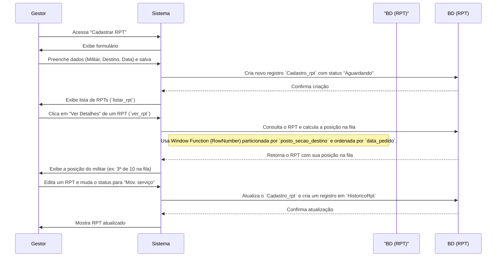

# App: RPT (Requerimento para Transferência)

O app `rpt` é o módulo do SisCoE responsável por gerenciar o **Requerimento para Transferência** de militares. Ele formaliza o processo de solicitação de movimentação e, crucialmente, cria uma fila de espera transparente para cada seção de destino.

---

## Modelo de Dados

O app é sustentado por dois modelos principais que trabalham em conjunto para gerenciar as solicitações e auditar o processo.

-   **`Cadastro_rpt`**: O modelo central. Cada registro representa uma solicitação de transferência ativa para um militar, vinculada ao seu `efetivo.Cadastro`. Ele armazena o destino desejado, as datas e o status atual da solicitação.
-   **`HistoricoRpt`**: Um modelo de auditoria que armazena um snapshot de cada alteração feita em um registro `Cadastro_rpt`, garantindo a rastreabilidade do processo.

!!! abstract "Modelo `rpt.models.Cadastro_rpt`"
    ::: backend.rpt.models.Cadastro_rpt
        options:
          show_root_heading: false
          show_source: false

---

## Fluxo de Trabalho e Fila de Espera

O principal valor do módulo `rpt` é a gestão da fila de espera para transferências, que funciona da seguinte maneira:

### A Lógica da Fila de Espera
A view `ver_rpt` é o coração desta funcionalidade. Ao visualizar uma solicitação, o sistema utiliza uma `Window Function` (`RowNumber`) do ORM do Django para calcular dinamicamente:
1.  A **posição exata** do militar na fila para a seção de destino.
2.  O **número total** de militares na mesma fila.

A ordenação da fila é baseada na `data_pedido` (data da solicitação), garantindo um critério justo e transparente.

---

## Funcionalidades Adicionais

-   **Importação e Exportação**: O app permite a importação (`importar_rpt`) e exportação (`exportar_rpt`) de dados em massa usando arquivos CSV ou Excel, facilitando a administração e a análise externa dos dados.
-   **Busca Integrada**: Ferramentas de busca (`buscar_militar_rpt`) permitem que os gestores encontrem rapidamente o militar para o qual desejam abrir uma solicitação.

---

## Endpoints (URLs) Principais

| URL | View | Nome da URL | Descrição |
| --- | --- | --- | --- |
| `/cadastrar_rpt/` | `cadastrar_rpt` | `cadastrar_rpt` | Exibe o formulário para criar uma nova solicitação de transferência. |
| `/listar_rpt/` | `listar_rpt` | `listar_rpt` | Lista todas as solicitações de transferência ativas. |
| `/ver_rpt/<int:id>/` | `ver_rpt` | `ver_rpt` | Exibe os detalhes de uma solicitação, incluindo a posição na fila. |
| `/editar_rpt/<int:id>/` | `editar_rpt` | `editar_rpt` | Permite a edição do status e dos dados de uma solicitação. |
| `/historico_rpt/<int:id>/` | `historico_rpt` | `historico_rpt` | Mostra o histórico completo de alterações de uma solicitação. |
| `/importar_rpt/` | `importar_rpt` | `importar_rpt` | Página para upload de arquivos para importação em massa. |
| `/exportar_rpt/` | `exportar_rpt` | `exportar_rpt` | Endpoint para baixar os dados de RPT em formato Excel ou CSV. |