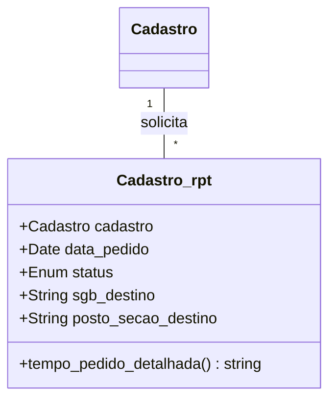
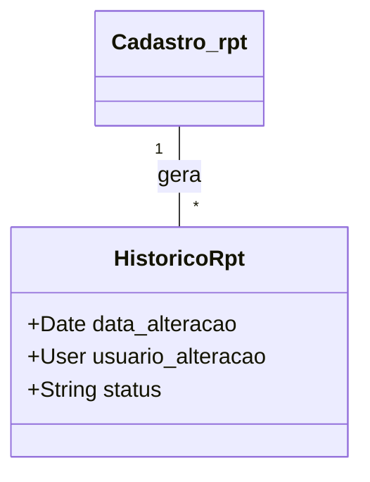
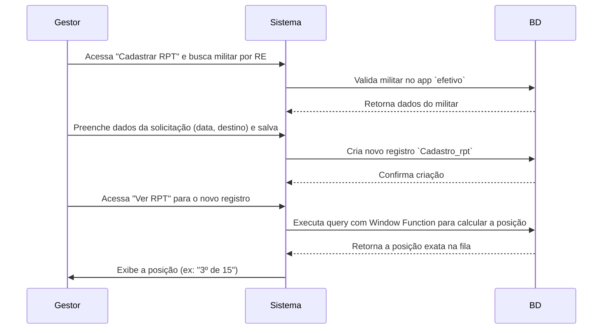

# 🧾 App: RPT (Relação de Prioridade de Transferência)

O app `rpt` é o módulo do SisCoE que gerencia a Relação de Prioridade de Transferência. Ele formaliza o processo de solicitação de movimentação, criando uma fila de espera transparente e justa para cada seção de destino, ordenada por critérios objetivos.

---

## 📋 Visão Geral

O propósito do app é substituir controles manuais e pouco transparentes por um sistema digital que garante justiça e visibilidade no processo de transferência. Ele atende ao RH (B/1) e aos próprios militares, que podem consultar sua posição na fila.

- 🎯 **Fila de Espera Inteligente**: Ordena os pedidos por data de solicitação, garantindo que os mais antigos tenham prioridade.
- 🔍 **Transparência Total**: Permite que qualquer militar veja sua posição exata na fila para a seção desejada.
- 📊 **Gestão Centralizada**: Oferece aos gestores uma visão completa de todas as solicitações de transferência do efetivo.
- 🔄 **Auditoria de Alterações**: Mantém um histórico de todas as mudanças de status ou dados de uma solicitação.
- 📥 **Gestão em Massa**: Suporta importação e exportação de dados para facilitar a administração.

---

## 🗂️ Modelos de Dados

A arquitetura de dados é focada no registro da solicitação e no seu histórico.

### Cadastro_rpt
O modelo principal, que representa uma solicitação de transferência ativa.

```python
class Cadastro_rpt(models.Model):
    cadastro = models.ForeignKey(Cadastro, on_delete=models.DO_NOTHING)
    data_pedido = models.DateField()
    status = models.CharField(max_length=50, choices=status_choices)
    sgb_destino = models.CharField(max_length=50, choices=sgb_choices)
    posto_secao_destino = models.CharField(max_length=50, choices=posto_secao_choices)
    doc_solicitacao = models.CharField(max_length=50)
    usuario_alteracao = models.ForeignKey(settings.AUTH_USER_MODEL, on_delete=models.SET_NULL, null=True)
```



### HistoricoRpt
Um modelo "espelho" que salva um snapshot de `Cadastro_rpt` sempre que uma alteração é feita, garantindo a trilha de auditoria.

```python
class HistoricoRpt(models.Model):
    cadastro = models.ForeignKey(Cadastro_rpt, on_delete=models.CASCADE)
    usuario_alteracao = models.ForeignKey(settings.AUTH_USER_MODEL, on_delete=models.SET_NULL, null=True)
    data_alteracao = models.DateTimeField(auto_now_add=True)
    # ... (réplica dos campos do Cadastro_rpt)
```



---

## 🔄 Fluxo de Trabalho

O fluxo principal é o cadastro de uma nova solicitação e o cálculo automático de sua posição na fila.



---

## 🎯 Funcionalidades Principais

- **Cálculo de Posição na Fila**: A funcionalidade central. A view `ver_rpt` usa uma `Window Function` (`RowNumber`) do Django ORM para calcular dinamicamente a posição do militar na fila para a seção de destino, ordenando por data do pedido.
- **Visualização Detalhada**: A mesma view exibe a posição do militar, o total de inscritos para a mesma seção e a lista completa de todos os concorrentes.
- **Cadastro de Solicitação**: Formulário para criar um novo pedido de transferência, buscando o militar pelo RE para evitar erros.
- **Exportação de Relatórios**: A view `exportar_rpt` gera relatórios em PDF, Excel e CSV das filas de espera, filtrando sempre pelo status "Aguardando".
- **Importação em Massa**: A view `importar_rpt` permite que administradores cadastrem múltiplas solicitações de uma vez a partir de um arquivo CSV ou Excel.

---

## 🔗 Relacionamentos

- **`efetivo` (Essencial)**: O app `rpt` é diretamente dependente do `efetivo.Cadastro`. Cada solicitação de transferência (`Cadastro_rpt`) pertence a um militar.
  ```python
  # No modelo Cadastro_rpt
  cadastro = models.ForeignKey(Cadastro, related_name='cadastro_rpt', on_delete=models.DO_NOTHING)
  ```

---

## 🛡️ Controles de Acesso e Validações

| View | Permissão Requerida | Acesso |
| :--- | :--- | :--- |
| `cadastrar_rpt` | Autenticação | Todos os usuários logados |
| `importar_rpt` | `rpt.add_cadastro_rpt` | Gestores e Admin |
| `excluir_rpt` | Autenticação e Senha | O próprio usuário ou Admin |

- **✅ Duplicidade**: O sistema impede que um mesmo militar tenha mais de uma solicitação com o status "Aguardando" ao mesmo tempo.
- **✅ Integridade**: A busca de militar por RE no formulário de cadastro garante que a solicitação seja sempre associada a um cadastro válido do `efetivo`.
- **✅ Exclusão Segura**: A exclusão de um registro exige a confirmação da senha do usuário logado.

---

## 📈 Métricas e Estatísticas

- **`tempo_pedido_detalhada`**: Uma `@property` no modelo `Cadastro_rpt` que calcula e exibe o tempo de espera de uma solicitação em formato legível (ex: "1 ano, 2 meses e 5 dias").
- **`pedido_status`**: Uma `@property` que retorna um badge HTML colorido indicando a faixa de tempo de espera (ex: "- de 1 ano", "+ de 2 anos"), usado para destaque visual na listagem.

---

## 🎨 Interface do Usuário

- **`listar_rpt.html`**: Exibe a tabela com todas as solicitações, usando os badges de tempo de espera para fácil identificação.
- **`ver_rpt.html`**: A tela de detalhes, que mostra em destaque a posição do militar na fila (ex: "Você é o 5º de 23 na fila") e a lista de todos os inscritos.
- **`cadastrar_rpt.html`**: Formulário de cadastro que inclui uma busca por RE para pré-preencher os dados do militar.

---

## 🔧 Configuração Técnica

**URLs Principais**
```python
app_name = 'rpt'

urlpatterns = [
    path('cadastrar_rpt/', views.cadastrar_rpt, name="cadastrar_rpt"),
    path('listar_rpt/', views.listar_rpt, name="listar_rpt"),
    path('ver_rpt/<int:id>/', views.ver_rpt, name="ver_rpt"),
    path('exportar_rpt/', views.exportar_rpt, name='exportar_rpt'),
    path('importar_rpt/', views.importar_rpt, name='importar_rpt'),
]
```

**Dependências e Tecnologias**
- **Django Window Functions**: A tecnologia chave usada para calcular a posição na fila de forma eficiente, diretamente no banco de dados.
- `pandas` e `openpyxl`: Para a funcionalidade de importação de dados via planilhas.
- `reportlab`: Para a exportação de relatórios em PDF.

---

## 💡 Casos de Uso

**Cenário Típico**: Um militar deseja ser transferido para o "EB CERRADO". Um gestor de RH acessa a tela "Cadastrar RPT", busca o militar pelo RE e preenche a data do pedido e a seção de destino. Ao salvar, o militar entra automaticamente na fila. Semanas depois, o militar acessa o sistema, vai para a sua solicitação de RPT e a tela informa: "Você é o 7º de 12 na fila para o EB CERRADO". Ele pode ver a lista de todos os 11 militares que estão à sua frente, ordenada por data de pedido.

**Benefícios**:
- **🎯 Transparência**: Elimina a incerteza, permitindo que todos vejam sua posição real na fila.
- **⚖️ Justiça**: A ordenação é baseada em um critério objetivo e auditável (data do pedido), garantindo um processo justo.
- **📊 Controle e Planejamento**: Permite ao comando visualizar a demanda por transferências para cada seção, auxiliando no planejamento de efetivo.
- **⚙️ Eficiência**: Automatiza o processo de gestão de filas, que antes era manual e propenso a erros.