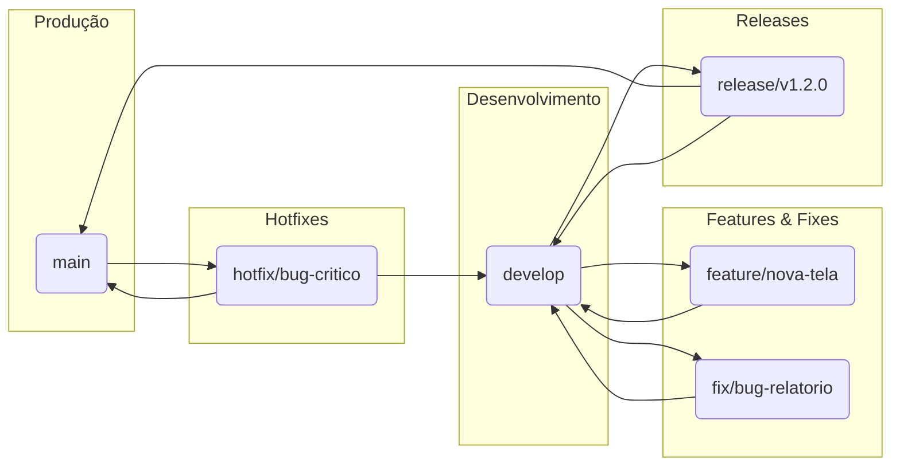

# Versionamento e Fluxo de Trabalho Git

Para garantir a estabilidade, a rastreabilidade e a colaboração eficaz no desenvolvimento do SisCoE, adotamos um conjunto de padrões para versionamento de software e para o fluxo de trabalho com o Git.

---

## Versionamento Semântico (SemVer)

O projeto utiliza o **Versionamento Semântico 2.0.0**. Todas as releases devem seguir o formato `MAJOR.MINOR.PATCH`.

-   **`MAJOR`**: Incrementada para mudanças incompatíveis de API (que quebram a retrocompatibilidade).
-   **`MINOR`**: Incrementada para adicionar funcionalidades de maneira retrocompatível.
-   **`PATCH`**: Incrementada para correções de bugs retrocompatíveis.

!!! info "Onde encontrar a versão?"
    A versão oficial do projeto é definida pelas **tags do Git** na branch `main`.

---

## Fluxo de Trabalho Git (Git Flow)

Utilizamos uma adaptação do **Git Flow** como nosso fluxo de trabalho de ramificação (branching model). Este modelo isola o trabalho em andamento do código de produção.



### Branches Principais

-   **`main`**: Reflete o código em **produção**. Todo commit na `main` é uma nova release e deve ser tagueado. Apenas branches de `release` ou `hotfix` podem ser mescladas aqui.
-   **`develop`**: É a branch de **integração** para o desenvolvimento. Contém as funcionalidades mais recentes que serão incluídas na próxima release.

### Fluxo de Desenvolvimento

1.  **Crie uma Branch a partir de `develop`**: Nunca trabalhe diretamente na `main` ou `develop`.

    ```bash
    # Para novas funcionalidades
    git checkout develop
    git pull
    git checkout -b feature/nome-da-sua-feature

    # Para correções de bugs não-urgentes
    git checkout develop
    git pull
    git checkout -b fix/descricao-do-bug
    ```

2.  **Desenvolva e Faça Commits**: Trabalhe na sua branch e faça commits pequenos e coesos usando o padrão de Commits Convencionais (veja abaixo).

3.  **Abra um Pull Request (PR)**: Ao concluir, envie sua branch para o repositório remoto e abra um Pull Request (PR) com a branch `develop` como destino.

4.  **Revisão e Merge**: Após a aprovação da revisão de código, seu PR será mesclado na `develop`.

!!! tip "Mantenha-se Atualizado"
    Mantenha sua branch sempre atualizada com a `develop` para evitar conflitos. Use `git pull origin develop` regularmente.

---

## Padrão de Commits (Conventional Commits)

Para manter um histórico de commits limpo e legível, seguimos a especificação [Conventional Commits](https://www.conventionalcommits.org/).

A estrutura é: `<tipo>[escopo opcional]: <descrição>`.

### Tipos de Commit Mais Comuns:

-   `feat`: Uma nova funcionalidade.
-   `fix`: Uma correção de bug.
-   `docs`: Mudanças apenas na documentação.
-   `style`: Mudanças que não afetam o significado do código (formatação, etc).
-   `refactor`: Uma alteração de código que não corrige um bug nem adiciona uma funcionalidade.
-   `test`: Adicionando ou corrigindo testes.
-   `chore`: Mudanças no processo de build ou em ferramentas auxiliares.

!!! example "Exemplos de Mensagens de Commit"
    - `feat(accounts): adicionar login social com Google`
    - `fix(efetivo): corrigir cálculo de idade do servidor`
    - `docs(arquitetura): adicionar diagrama de fluxo de requisição`